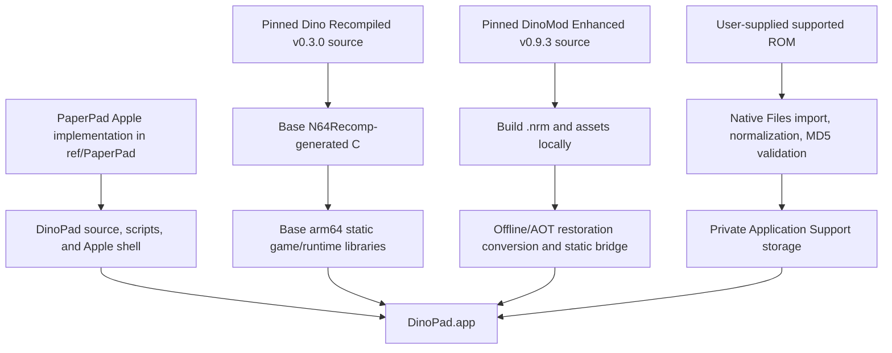

# DinoPad Implementation Plan

**Project name:** DinoPad  
**Repository name:** `dinopad`  
**Expected GitHub repository:** `chrissotraidis/dinopad`  
**Bundle identifier:** `com.chrissotraidis.dinopad`  
**Primary reference implementation:** `ref/PaperPad`  
**Secondary product/release reference:** HarkinianPad  
**Document role:** Source of truth for the DinoPad implementation loop  
**Research baseline:** 2026-08-15

> **Canonical spelling:** Use **DinoPad** everywhere. Do not alternate between DinoPad, DynoPad, or DinosaurPad.

---

## 1. Executive decision

DinoPad should be a **ROM-free, native Apple Silicon static-recompilation port of the December 2000 Dinosaur Planet prototype** for:

1. Apple Silicon macOS
2. iPhone
3. iPad

The recommended user experience is:

- **Restored Adventure** — the default and recommended mode, powered by a pinned, build-time-integrated release of DinoMod Enhanced.
- **Prototype Mode** — an explicitly archival mode that runs the base Dinosaur Planet recompilation without DinoMod’s progression restoration.

The project should **not** attempt to become:

- a general Nintendo 64 emulator;
- a universal N64 Recomp launcher;
- a user-updatable iOS mod manager;
- a runtime `.nrm` code loader;
- a compatibility layer for arbitrary old or future DinoMod releases;
- an App Store project during the initial implementation.

DinoMod should advance only through normal DinoPad application updates. Every DinoPad release pins one tested Dinosaur Planet Recompiled version and one tested DinoMod Enhanced version.

The public release target should follow the successful HarkinianPad/PaperPad shape:

- public source;
- reproducible build scripts;
- user-supplied supported ROM;
- no game data in Git;
- ROM-free unsigned IPA for self-signing;
- honest platform and playtest status;
- strong README, screenshots, diagnostics, and release checks.

The headline is:

> **Rare’s unreleased N64 adventure, restored and running natively on iPhone and iPad.**

Use **restored**, not **remastered**. DinoMod repairs and extends an unfinished prototype; it is not a conventional remaster.

---

## 2. Research findings that determine the architecture

### 2.1 Upstream baseline

| Component | Research baseline | Implication |
|---|---|---|
| Dinosaur Planet: Recompiled | Release `v0.3.0`, published 2026-05-31 | Start from the latest stable release, not moving `main`. |
| Dino Recompiled platforms | Windows and Linux release assets; macOS support issue remains open | macOS is the first engineering milestone, not an already-supported configuration. |
| Dino Recompiled license | GPLv3 | DinoPad must preserve GPL obligations and publish corresponding source for distributed builds. |
| DinoMod Enhanced | Release `v0.9.3`, published 2026-06-22 | Initial restored profile should pin this release because it is explicitly compatible with Dino Recompiled `v0.3.0`. |
| DinoMod package | `.nrm` containing MIPS mod code, hooks/configuration, and assets | Desktop-style live mod loading cannot simply be carried onto iOS. |
| DinoMod manifest | No native libraries declared in `v0.9.3` | A pure offline/AOT conversion path may be feasible without platform-specific DinoMod binaries. |
| DinoMod repository policy | README states a strict no-AI policy; no conventional license was visible during the research pass | Treat the source as read-only and redistribution as prohibited until maintainers grant explicit permission or publish a compatible license. |
| N64Recomp | Generates C that can be compiled for native targets | Base game code is suitable in principle for arm64 Apple targets. |
| N64Recomp `OfflineModRecomp` | Converts a mod symbol file and binary into C, but its source describes the path as primarily intended for debugging | Use it as the leading feasibility path, not as an assumed production solution. Validate it thoroughly. |
| RT64 | Public renderer supports D3D12, Vulkan, and Metal; public platform list includes macOS, not iOS | PaperPad’s Apple patches are the concrete iOS reference, not RT64’s upstream README alone. |
| PaperPad | Native static arm64 game code, Metal, iPhone/iPad shell, touch controls, ROM import, diagnostics, ROM-free unsigned IPA | Reuse its architecture and Apple shell patterns instead of inventing a second platform layer. |
| Apple review rule 2.5.2 | Apps generally may not download, install, or execute code that changes app functionality | A pinned, build-time-integrated DinoMod is safer than a downloadable `.nrm` runtime on iOS. |

### 2.2 Exact initial pins

The first reproducible branch should begin with these pins:

```text
PaperPad reference:
  commit 644945d4bc4facbbd8ecda8cdfd37ae64e7993fa

Dinosaur Planet: Recompiled:
  tag v0.3.0

DinoMod Enhanced:
  tag v0.9.3

Dinosaur Planet ROM:
  December 2000 prototype
  MD5 49f7bb346ade39d1915c22e090ffd748
```

Do not automatically replace these with current `main` branches during bootstrap. First establish a reproducible build. Upstream upgrades are separate, test-gated work.

Dino Recompiled’s recursive submodule pins at `v0.3.0` are the initial runtime/rendering dependency set. PaperPad’s dependency revisions are references for Apple patches and architecture, not permission to silently replace Dino Recompiled’s entire dependency graph.

### 2.3 What PaperPad should supply

Use `ref/PaperPad` as a read-only donor/reference for:

- source pinning and `dependencies.lock.json`;
- ignored `ref/` and `generated/` workspaces;
- patch replay;
- macOS and iOS Simulator build scripts;
- native Files document picker;
- exact ROM validation and private storage;
- UIKit/Objective-C++ application shell;
- Metal/Retina drawable handling;
- safe-area and lifecycle handling;
- touch controls;
- independent phone and tablet layouts;
- touch opacity and layout editing;
- persistent `•••` menu;
- controller connection/disconnection handoff;
- settings presentation;
- bounded logs and shareable diagnostics;
- repository safety audit;
- unsigned IPA packaging;
- release checklist;
- README structure and evidence standards;
- strict one-Simulator-at-a-time workflow.

Do not blindly copy PaperPad’s game-specific runtime code. Port the Apple-facing abstractions and preserve their behavior while connecting them to Dino Recompiled’s runtime.

---

## 3. Product definition

### 3.1 First-run flow

1. User launches DinoPad.
2. DinoPad presents a native setup screen.
3. User chooses a supported Dinosaur Planet ROM through Files.
4. DinoPad:
   - opens a security-scoped copy;
   - detects byte order;
   - normalizes locally if needed;
   - verifies the exact supported ROM fingerprint;
   - stores the private normalized ROM in the app container;
   - never uploads or downloads game data.
5. DinoPad presents:
   - **Continue Restored Adventure**, when a restored save exists;
   - **New Restored Adventure**;
   - **Prototype Mode** under an archival/advanced section.
6. The game launches natively through the static arm64 runtime.

### 3.2 Default mode: Restored Adventure

Restored Adventure is the product.

It should provide:

- pinned DinoMod Enhanced functionality;
- progression fixes;
- restored/expanded assets permitted for redistribution;
- DinoMod configuration options exposed through a native settings bridge;
- separate restored save namespace;
- rolling save protection where technically safe;
- touch controls;
- controllers;
- Metal rendering;
- 4:3 and widescreen options;
- tested frame-rate modes;
- diagnostics;
- accurate version metadata.

### 3.3 Secondary mode: Prototype Mode

Prototype Mode exists for preservation and comparison.

UI copy must be honest:

> Runs the base December 2000 prototype without DinoMod Enhanced. The recompilation still contains platform, renderer, and compatibility patches, and the surviving game may be incomplete or progression-blocked.

Requirements:

- separate save namespace;
- restoration hooks and restoration assets disabled;
- conservative default rendering: original aspect ratio and original gameplay frame rate;
- prominent warning before beginning;
- no promise of start-to-credits completion;
- no contamination from restored saves or configuration.

Do not call it “bit-perfect,” “untouched,” or “the completely original ROM experience” unless that claim is later proven.

### 3.4 The `•••` menu

Port PaperPad’s persistent menu behavior and visual shape as closely as practical.

Minimum menu structure:

```text
Resume

Game
  Mode
  Restoration Settings
  Save / Recovery Status

Controls
  Touch Controls
  Touch Opacity
  Customize Touch Layout
  Reset Phone Layout
  Reset Tablet Layout
  Controller Status

Display
  Aspect Ratio
  Internal Resolution
  Frame Rate
  HUD Placement

Audio
  Master Volume

Game Data
  Manage Game ROM

Support
  Share Diagnostics & Logs
  Version Information
  Known Issues

Quit to DinoPad Home
```

Opening the menu, document picker, settings sheet, or share sheet must:

- clear held virtual input;
- hide gameplay touch targets;
- pause when safe;
- restore touch targets only when the sheet closes and touch controls remain enabled.

A connected controller hides gameplay touch controls but never hides the `•••` button.

### 3.5 Public MVP

The first public preview is ready only when it has:

- Apple Silicon macOS build;
- iPhone and iPad device builds;
- ROM import and validation;
- Restored Adventure available under a legally cleared integration;
- Prototype Mode;
- audio;
- saves;
- complete N64 touch input;
- hardware controller play;
- persistent `•••` menu;
- independent phone/tablet layouts;
- settings and diagnostics;
- evidence on one physical iPhone and one physical iPad;
- a ROM-free, unsigned IPA;
- a complete README and release checklist;
- no known immediate early-game progression blocker in Restored Adventure.

### 3.6 Explicit non-goals for Preview 1

- App Store or TestFlight distribution.
- Arbitrary `.nrm` installation.
- In-app downloading of mods or game data.
- Backward compatibility with old DinoMod packages.
- Same-day independent DinoMod updates.
- A universal N64 game library.
- Online multiplayer.
- 120 Hz as a release requirement.
- iCloud save sync.
- external-display controller mode;
- a full museum/archive browser;
- HD texture packs;
- every DinoMod optional setting if a safe generic bridge is not yet complete.

---

## 4. Proposed technical architecture



### 4.1 Runtime layers

#### `DinoPadPlatform`

Apple-facing lifecycle and services:

- UIKit/app lifecycle;
- macOS application lifecycle;
- Metal layer/surface creation;
- safe-area geometry;
- orientation;
- Files import;
- app-container paths;
- audio session;
- background/foreground;
- clipboard/share sheet;
- diagnostics;
- device and screen metadata.

#### `DinoPadInput`

- full N64 input state;
- multi-touch tracking;
- floating or fixed analog behavior matching PaperPad;
- D-pad;
- A/B/Z/L/R/Start/C-buttons;
- game-controller mapping;
- controller/touch handoff;
- input clearing during UI transitions;
- keyboard mapping on macOS;
- optional deterministic input replay for smoke testing.

#### `DinoPadRuntime`

- base recompiled game;
- N64ModernRuntime integration;
- RT64 Metal renderer;
- ROM reads;
- audio;
- saves;
- configuration bridge;
- renderer settings;
- frame timing;
- clean shutdown.

#### `DinoPadRestoration`

- pinned DinoMod code and metadata;
- AOT/offline converted mod functions;
- hook/replacement/event registration;
- asset patch contribution;
- generated config schema;
- enable/disable at session start;
- version reporting.

#### `DinoPadUI`

- first-run ROM setup;
- home/mode chooser;
- persistent `•••` menu;
- settings;
- touch layout editor;
- diagnostics;
- warnings and errors.

### 4.2 Build-time versus runtime boundaries

Build time may:

- download public source repositories;
- build N64Recomp tools;
- generate base AOT C code locally;
- build a pinned DinoMod `.nrm`;
- convert pinned DinoMod code into static C if the feasibility gate succeeds;
- generate configuration bindings;
- compile all executable code into the signed app;
- package non-game, legally distributable data;
- generate an unsigned IPA.

Runtime may:

- import the user’s ROM;
- validate and normalize it;
- read game assets from the private ROM;
- create saves/config/logs;
- select between already-compiled Restored and Prototype profiles;
- load ordinary non-executable configuration/data already inside the app.

Runtime must not:

- download or execute code;
- JIT MIPS into arm64;
- load arbitrary `.nrm` code;
- silently update DinoMod;
- fetch a ROM;
- write outside the app container.

---

## 5. Repository shape

```text
dinopad/
├── README.md
├── COPYING
├── RIGHTS_AND_LICENSES.md
├── CONTRIBUTING.md
├── CMakeLists.txt
├── dependencies.lock.json
├── .gitignore
├── .gitattributes
├── .github/
│   └── workflows/
│       ├── source-audit.yml
│       └── compile-check.yml
├── apple/
│   ├── app/
│   ├── assets/
│   ├── ios/
│   ├── macos/
│   ├── platform/
│   ├── touch/
│   └── ui/
├── src/
│   ├── app/
│   ├── input/
│   ├── runtime/
│   ├── restoration/
│   └── testing/
├── include/
├── cmake/
├── patches/
│   ├── dino-recomp/
│   ├── n64modernruntime/
│   ├── rt64/
│   ├── sdl/
│   └── paperpad-port-notes/
├── scripts/
│   ├── bootstrap.sh
│   ├── clone-sources.sh
│   ├── apply-patches.sh
│   ├── build-tools.sh
│   ├── generate-base.sh
│   ├── generate-restoration.sh
│   ├── build-macos-app.sh
│   ├── build-ios-simulator.sh
│   ├── build-ios-device.sh
│   ├── package-ios.sh
│   ├── runtime-guard.sh
│   ├── smoke-macos.sh
│   ├── smoke-ios.sh
│   ├── capture-evidence.sh
│   ├── check-repo-safety.sh
│   ├── check-package-safety.sh
│   ├── check-upstream-updates.sh
│   └── report-size.sh
├── tools/
│   ├── generate_mod_settings.py
│   ├── compare_ui.py
│   ├── normalize_rom.py
│   └── validate_evidence.py
├── docs/
│   ├── IMPLEMENTATION_PLAN.md
│   ├── STATUS.md
│   ├── ARCHITECTURE.md
│   ├── BUILDING.md
│   ├── TESTING.md
│   ├── PLAYTEST_MATRIX.md
│   ├── UPSTREAM.md
│   ├── DINOMOD_INTEGRATION.md
│   ├── UI_PARITY.md
│   ├── KNOWN_ISSUES.md
│   ├── TECH_DEBT.md
│   ├── RELEASE_CHECKLIST.md
│   ├── DEPENDENCIES.md
│   ├── LEGAL.md
│   ├── INSTALL_IPA.md
│   ├── decisions/
│   └── evidence/
├── ref/                    # ignored; exact source checkouts
├── generated/              # ignored; ROM-derived/AOT output
├── private-fixtures/       # ignored; private ROM/saves
├── build-macos/            # ignored
├── build-ios-simulator/    # ignored
├── build-ios-device/       # ignored
└── .goal-loop/             # ignored runtime state/locks
```

### 5.1 Reference source rules

- `ref/PaperPad` is required.
- Clone exact pinned revisions into `ref/`.
- Disable push URLs for all reference checkouts.
- Never edit a file in `ref/` as the final solution.
- Every maintained upstream modification lives as:
  - a DinoPad-owned adapter;
  - a replayable patch under `patches/`; or
  - a documented exact dependency update.
- Do not create nested copies of the same repository.
- Do not commit `ref/`, `generated/`, build trees, ROMs, saves, or signing material.

### 5.2 Dependency lock requirements

Each entry in `dependencies.lock.json` must include:

```json
{
  "name": "dino-recomp",
  "url": "https://github.com/DinosaurPlanetRecomp/dino-recomp.git",
  "ref": "v0.3.0",
  "commit": "<resolved full SHA>",
  "license_file": "COPYING",
  "purpose": "Base Dinosaur Planet static recompilation"
}
```

Also record:

- recursive submodule commits;
- PaperPad reference commit;
- DinoMod release tag and source commit;
- supported ROM fingerprints;
- patch-set checksum;
- toolchain versions used by a public release.

---

## 6. Upstream and patch strategy

### 6.1 Stable first, current later

Bootstrap against:

- Dino Recompiled `v0.3.0`;
- DinoMod Enhanced `v0.9.3`;
- the exact recursive submodules selected by Dino Recompiled `v0.3.0`.

Do not begin from current `main`. Once Preview 1 is stable, an upstream-update branch may evaluate later releases.

### 6.2 Patch isolation

Every patch must answer:

1. Why is this needed on Apple?
2. Is it game-specific or platform-generic?
3. Can it be implemented in DinoPad instead of changing upstream?
4. Does PaperPad already solve it?
5. Does it preserve Windows/Linux upstream semantics?
6. How is it tested?
7. What upstream version does it apply to?

Patch filenames should be ordered:

```text
0001-cmake-add-apple-targets.patch
0002-rt64-enable-ios-metal-surface.patch
0003-runtime-disable-live-recomp-on-mobile.patch
...
```

### 6.3 Upstream update procedure

A version update is never “change the tag and see what happens.”

1. Create an update branch.
2. Update one upstream component at a time.
3. Record the old/new tag and commit.
4. Reapply patches.
5. Classify every conflict.
6. Build macOS.
7. Run macOS smoke test.
8. Build iPhone Simulator.
9. Run iPhone smoke test.
10. Shut it down.
11. Build iPad Simulator.
12. Run iPad smoke test.
13. Run private fixture matrix.
14. Compare screenshots.
15. Update `docs/UPSTREAM.md`.
16. Merge only after the previously green matrix remains green.

No user-facing backward-compatibility layer is required. A DinoPad release supports only its bundled pins.

---

## 7. DinoMod Enhanced integration strategy

### 7.1 Hard policy gate

Before a public Restored Adventure binary or source integration is distributed:

- obtain explicit maintainer permission or a published license compatible with DinoPad’s intended redistribution;
- clarify whether DinoPad may:
  - build DinoMod from source;
  - include converted native code;
  - include its manifest/configuration;
  - include or generate its asset patches;
  - display “DinoMod Enhanced” in the app;
  - ship an unsigned IPA containing the integration;
- preserve attribution to every listed contributor;
- respect the repository’s strict no-AI policy.

Until cleared:

- keep `ref/dinomod-enhanced-recompiled` read-only;
- do not generate or submit changes to DinoMod;
- do not open AI-authored pull requests against it;
- do not bundle its source or package in a public DinoPad release;
- isolate all bridge work in DinoPad-owned files;
- mark Restored release status as blocked.

This is a release gate, not a reason to stop the base Apple port.

### 7.2 Preferred production path

The preferred path is:

```text
Pinned DinoMod source
    ↓
Build MIPS mod ELF and .nrm
    ↓
Extract mod symbols/binary/assets
    ↓
N64Recomp OfflineModRecomp or equivalent maintained AOT path
    ↓
Generated C for mod functions
    ↓
DinoPad static restoration bridge
    ↓
arm64 object code inside DinoPad
```

The bridge must provide:

- imported base-game function resolution;
- reference symbol resolution;
- function replacements;
- hooks;
- callbacks/events;
- configuration reads;
- section addresses;
- asset registration;
- save-extension support if used;
- deterministic initialization and teardown.

### 7.3 Feasibility experiments

Perform these experiments in order.

#### Experiment A — inspect package without executing it

- Build DinoMod `v0.9.3` from source.
- Verify resulting package checksum.
- Inventory:
  - MIPS code size;
  - symbol data;
  - hooks/replacements;
  - events/callbacks;
  - config options;
  - assets;
  - native libraries.
- Confirm `native_libraries` is empty for the pinned release.
- Write results to `docs/DINOMOD_INTEGRATION.md`.

#### Experiment B — offline recompilation

- Build the exact compatible N64Recomp tools.
- Run `OfflineModRecomp` on the DinoMod symbol and binary payload.
- Compile emitted C for macOS arm64.
- Resolve all imports.
- Register only one harmless hook or exported function in a test harness.
- Confirm deterministic output and clean execution under ASan/UBSan where possible.

#### Experiment C — full macOS static restoration

- Integrate every hook/replacement/event.
- Integrate assets.
- Reproduce the same visible behavior as desktop Dino Recompiled + official DinoMod `v0.9.3`.
- Test at least one known progression repair and one optional setting.
- Compare saves and config behavior.
- Keep the ordinary desktop `.nrm` build as the behavior oracle.

#### Experiment D — disable path

- Compile the restoration module into the application.
- Launch Prototype Mode without registering restoration hooks or assets.
- Verify a known DinoMod-visible change is absent.
- Launch Restored Adventure and verify it is present.
- Verify the modes use separate saves.

#### Experiment E — iOS static link

- Compile the same generated restoration C into the iOS arm64 target.
- Confirm:
  - no executable-memory entitlement;
  - no JIT;
  - no live recompiler;
  - no runtime-generated machine code;
  - no downloaded code;
  - package contains only signed static code.

### 7.4 Fallback order

If `OfflineModRecomp` is unsuitable:

1. Extend/fix an offline AOT bridge in DinoPad or a compatible upstream component, while keeping the change generic.
2. Statically translate the pinned DinoMod ELF through N64Recomp’s existing APIs in DinoPad’s build tooling.
3. With maintainer permission, convert DinoMod’s changes into a build-time linked patch library without modifying its upstream source.
4. Release a Prototype-only technical preview while restoration work remains blocked.

Do **not** respond by adding an iOS JIT, arbitrary interpreter, or downloadable code system to Preview 1.

### 7.5 Native settings generation

Use `tools/generate_mod_settings.py` to parse the pinned `mod.toml` and generate:

- stable setting IDs;
- types;
- labels;
- descriptions;
- enum choices;
- defaults;
- C++ lookup bindings;
- a native settings schema consumed by UIKit.

This makes future application updates easier without promising runtime compatibility. Unknown or unsupported option types should fail the build rather than silently disappear.

---

## 8. Platform implementation phases

## Phase 0 — Repository and documentation bootstrap

### Goals

- Initialize `dinopad`.
- Add this file as `docs/IMPLEMENTATION_PLAN.md`.
- Add the goal loop.
- Add `.gitignore`.
- Add canonical naming.
- Add dependency lock.
- Clone PaperPad into `ref/PaperPad`.
- Clone pinned upstream repositories.
- Create safety scripts.
- Create initial docs.

### Acceptance criteria

- Fresh clone can run `scripts/bootstrap.sh`.
- Every source checkout resolves to an exact commit.
- Reference push URLs are disabled.
- `git status` contains no reference source, ROM, build, or generated code.
- `scripts/check-repo-safety.sh` passes.
- `docs/STATUS.md` names exactly one active goal.

---

## Phase 1 — Reproduce upstream behavior on a supported desktop oracle

Although macOS is the first port target, preserve a behavior oracle.

### Goals

- Build/run unmodified Dino Recompiled `v0.3.0` on a supported Windows/Linux environment when one is available, or use its official release as the behavioral reference.
- Install official DinoMod `v0.9.3`.
- Record:
  - ROM import behavior;
  - title/boot flow;
  - input;
  - audio;
  - saves;
  - settings;
  - DinoMod settings;
  - one known restoration fix;
  - screenshots.

### Acceptance criteria

- `docs/UPSTREAM.md` contains exact commands, versions, and observations.
- Reference screenshots are stored privately or under a legally appropriate evidence path.
- No upstream reference files are modified.

This phase may be documented from an existing known-good desktop if the development Mac cannot run the official build.

---

## Phase 2 — Apple Silicon macOS base build

### Goal order

1. Compile all host tools on Apple Silicon.
2. Generate base game code.
3. Compile base runtime for arm64.
4. Enable RT64 Metal.
5. Create a macOS window/surface.
6. Load the private supported ROM.
7. Render one frame.
8. Reach the title screen.
9. Reach controllable gameplay.
10. Verify audio, keyboard/controller input, saves, and clean quit.

### Scope control

Initially keep or bypass the upstream launcher according to the shortest path:

- If RmlUi and the desktop launcher compile cleanly, use them temporarily.
- If they block the first frame, bypass them with a minimal DinoPad launch configuration and native ROM path.
- Do not spend days polishing a desktop launcher before gameplay renders.

### Acceptance criteria

- `scripts/build-macos-app.sh --rom <private-rom>` succeeds from a clean source state.
- Incremental rebuild succeeds without regenerating everything.
- `DinoPad.app` is arm64.
- App bundle does not contain the ROM.
- Title screen renders through Metal.
- At least 10 continuous minutes of controllable gameplay are logged.
- Audio is audible.
- Save file is created and reloads.
- App quits without leaving a stale process.
- Screenshot and log evidence exist.
- All Simulators are shut down during the test.

---

## Phase 3 — Static DinoMod on macOS

### Goals

- Complete the experiments in Section 7.
- Make Restored Adventure the default profile.
- Add Prototype Mode.
- Add separate saves.
- Add version reporting.
- Add native restoration settings bridge.

### Acceptance criteria

- Restored mode visibly applies the pinned restoration.
- Prototype mode visibly omits it.
- A known progression blocker fixed by DinoMod is verified.
- At least one DinoMod configuration option changes behavior.
- Both modes can be selected repeatedly without save leakage.
- No live recompilation is required for Restored mode.
- `docs/DINOMOD_INTEGRATION.md` fully documents the build and runtime bridge.
- Maintainer permission/license gate is recorded separately from technical success.

---

## Phase 4 — Port the PaperPad Apple shell

### Goals

Port the behavior of PaperPad’s Apple-facing components:

- app lifecycle;
- native ROM setup;
- storage paths;
- diagnostics;
- Metal surface ownership;
- touch overlay;
- layout editor;
- `•••` menu;
- settings;
- controller handoff;
- safe areas;
- foreground/background;
- input clearing;
- display scaling.

### UI parity acceptance criteria

On equivalent iPhone/iPad Simulator sizes:

- menu button is in the same safe-area-relative position as PaperPad, within 8 points unless documented;
- touch control centers are within 12 points of the PaperPad defaults unless a Dinosaur Planet control need justifies a change;
- no control is clipped or placed under the Home indicator;
- phone/tablet layouts are independent;
- menu opening hides gameplay controls;
- controller connection hides gameplay controls;
- screenshots show comparable visual hierarchy and spacing;
- every intentional difference is recorded in `docs/UI_PARITY.md`.

Do not copy Paper Mario artwork or screenshots into DinoPad.

---

## Phase 5 — iPhone Simulator

### Goals

- Cross-compile all runtime code to iOS Simulator arm64.
- Replace desktop-only APIs.
- Install through `simctl`.
- Import ROM through Files.
- Boot Restored Adventure.
- Validate touch input and menu.
- Capture screenshots.

### Acceptance criteria

- Only one iPhone Simulator is booted.
- No macOS DinoPad process is running.
- Clean build installs.
- ROM picker works.
- Unsupported ROM fails with a useful error.
- Supported ROM reaches title and gameplay.
- A/B/Z/Start/analog/C-buttons all register.
- `•••` menu works.
- background/foreground round trip does not leave held input.
- save persists after relaunch.
- 10-minute smoke session completes.
- evidence and docs are updated.
- Simulator is terminated and shut down after the run.

---

## Phase 6 — iPad Simulator

Begin only after iPhone Simulator is green and shut down.

### Goals

- Boot exactly one iPad Simulator.
- Validate tablet layout.
- Validate resizing/orientation policy.
- Validate larger menu/settings presentation.
- Validate controller handoff.
- Capture screenshots and compare to PaperPad tablet UI.

### Acceptance criteria

- iPhone Simulator is shut down first.
- only one iPad Simulator is booted;
- game reaches controllable Restored gameplay;
- full touch layout fits;
- independent tablet layout persists;
- no safe-area clipping;
- menu and settings are readable;
- save persists;
- screenshot parity report passes;
- Simulator is shut down after evidence collection.

---

## Phase 7 — Physical iPhone

### Goals

- sign and install in place;
- preserve app container during updates;
- test touch;
- test audio;
- test suspend/resume;
- test thermal behavior;
- test controller if available.

### Acceptance criteria

- launch on a supported physical iPhone;
- ROM import succeeds;
- at least 30 minutes of gameplay;
- no severe thermal throttling or memory termination;
- touch controls remain responsive;
- speaker and headphone/Bluetooth audio are tested as available;
- controller connect/disconnect is tested;
- save survives an in-place update;
- diagnostics can be shared;
- evidence recorded without committing private device data.

---

## Phase 8 — Physical iPad

### Goals

- repeat device validation on iPad;
- test tablet layout;
- test controller-centric play;
- test sustained performance;
- test external keyboard where available.

### Acceptance criteria

- at least 60 minutes of cumulative play;
- tablet controls usable;
- controller play usable;
- menu remains available;
- audio and save behavior verified;
- no memory termination;
- in-place update preserves ROM and saves;
- evidence documented.

---

## Phase 9 — Progression and stability

### Automated/private fixture matrix

Create private, ignored save fixtures at meaningful chapter boundaries when legally and technically appropriate. Commit only a manifest describing:

- fixture name;
- expected area;
- expected mode;
- private checksum;
- expected next transition;
- known risk;
- last verification date.

For each fixture:

1. install/copy privately;
2. launch one target;
3. load;
4. exercise the critical transition;
5. capture log;
6. capture screenshot;
7. record pass/fail;
8. close target.

### Required progression evidence

Before calling Restored Adventure “playable start-to-credits”:

- one complete human start-to-credits playthrough on a physical Apple device;
- chapter-boundary regression checks;
- known DinoMod progression fixes exercised;
- no unresolved save-corrupting defect;
- no recurring crash without a recovery path.

The autonomous loop may automate smoke and fixture tests. It must not claim a full playthrough it did not perform.

Prototype Mode requires smoke coverage, not completion.

---

## Phase 10 — Release and README

### Public package

- source tag;
- ROM-free unsigned IPA;
- SHA-256;
- source/commit match;
- no provisioning profile;
- no maintainer identity;
- no ROM;
- no saves;
- no generated assets prohibited from distribution;
- no private logs;
- required licenses/notices;
- exact Dino Recompiled/DinoMod versions;
- clear self-signing instructions.

### README quality bar

Use PaperPad and HarkinianPad as the structural quality references.

Required sections:

1. Hero screenshot.
2. One-sentence pitch.
3. platform/renderer/release/game-data badges.
4. What DinoPad is and is not.
5. current target status matrix.
6. download status.
7. requirements.
8. build commands.
9. first launch.
10. Restored versus Prototype modes.
11. touch controls and `•••` menu.
12. controller/keyboard mappings.
13. screenshots.
14. what works.
15. supported ROM and fingerprint.
16. diagnostics.
17. reproducible/ROM-free pipeline diagram.
18. known limitations.
19. installation guide.
20. legal/rights boundary.
21. credits.
22. honest stability language.

No README claim may outrun `docs/STATUS.md` or `docs/PLAYTEST_MATRIX.md`.

---

## 9. One-runtime-at-a-time resource discipline

This is a hard project rule.

### 9.1 Runtime exclusivity

At no time may more than one of these be active:

- DinoPad macOS application;
- an iPhone Simulator running DinoPad;
- an iPad Simulator running DinoPad;
- a physical-device automated launch session controlled by the loop.

Before launching any target:

```sh
pkill -x DinoPad 2>/dev/null || true
xcrun simctl terminate booted com.chrissotraidis.dinopad 2>/dev/null || true
xcrun simctl shutdown all 2>/dev/null || true
```

Then launch exactly one target.

The loop must create `scripts/runtime-guard.sh` that:

- uses an atomic lock directory at `.goal-loop/runtime.lock`;
- records target, device UDID, PID, command, and start time;
- refuses a second launch;
- verifies no conflicting target;
- installs cleanup traps;
- terminates the app;
- shuts down the Simulator;
- removes stale locks only after verifying the old PID/device is gone.

### 9.2 Build concurrency

Default:

```text
DINOPAD_MAX_JOBS = min(6, max(2, logical_cpu_count / 2))
```

Rules:

- one `cmake --build`, `ninja`, or `xcodebuild` process at a time;
- no simultaneous macOS and iOS builds;
- no `-j` equal to every core on a memory-constrained machine;
- reduce to 2–4 jobs after memory pressure;
- prefer incremental builds;
- clean only when the failure evidence points to stale output.

### 9.3 Disk and repository size

Before a full generation/build:

- require at least 20 GiB free;
- print `df -h`;
- print `du -sh ref generated build-*`;
- avoid duplicate source clones;
- prune obsolete DerivedData and old evidence;
- never commit a file above 10 MiB without a written exception;
- keep public screenshots curated and optimized;
- do not commit videos;
- keep release binaries in GitHub Releases, not Git history.

`scripts/report-size.sh` must report tracked size, ignored workspace size, build trees, and the largest files.

---

## 10. Testing and evidence contract

### 10.1 Test layers

#### Build tests

- host tools;
- macOS arm64;
- iOS Simulator arm64;
- iOS device arm64;
- package audit.

#### Unit tests

- ROM byte-order normalization;
- fingerprint validation;
- path sanitization;
- settings serialization;
- mode/save namespace selection;
- touch coordinate mapping;
- controller mapping;
- DinoMod manifest parsing;
- diagnostics redaction;
- runtime guard behavior.

#### Smoke tests

- launch;
- ROM setup;
- title;
- gameplay;
- input;
- audio marker/log;
- save;
- relaunch;
- menu;
- clean shutdown.

#### Visual tests

- app shell;
- safe areas;
- touch layout;
- menu;
- settings;
- error states;
- title/gameplay rendering sanity.

#### Progression tests

- private chapter fixtures;
- known DinoMod repairs;
- long session;
- start-to-credits human run.

### 10.2 Evidence layout

```text
docs/evidence/
└── 2026-08-15/
    ├── macos/
    │   ├── build.txt
    │   ├── runtime.log
    │   ├── title.png
    │   └── gameplay.png
    ├── iphone-simulator/
    ├── ipad-simulator/
    └── ui-compare/
```

Every evidence set must include:

- DinoPad commit;
- upstream pins;
- target and OS;
- build command;
- launch command;
- result;
- duration;
- screenshot;
- relevant log excerpt;
- known limitations;
- cleanup confirmation.

Screenshots are evidence, not decoration. Delete duplicates and stale failed captures after their findings are documented.

### 10.3 Screenshot capture

Examples:

```sh
xcrun simctl io booted screenshot docs/evidence/<date>/<target>/screen.png
```

For macOS, capture only after identifying the DinoPad window. Do not capture unrelated private desktop content.

`tools/compare_ui.py` should compare DinoPad’s Apple shell to locally available PaperPad reference captures and report:

- image dimensions;
- safe-area offsets;
- control centers;
- menu-button bounds;
- clipping;
- large visual deltas.

Pixel-perfect game imagery is not expected. UI geometry and behavior are the comparison target.

---

## 11. Documentation contract

The goal loop must continually write and rely on documentation.

### `docs/STATUS.md`

Always current. Contains:

- current phase;
- current single goal;
- last verified commit;
- green targets;
- red targets;
- exact last successful commands;
- blockers;
- next three candidate goals;
- latest evidence links;
- current upstream pins.

### `docs/ARCHITECTURE.md`

- runtime diagram;
- thread model;
- renderer ownership;
- input flow;
- save/config paths;
- mode/restoration boundary;
- mobile no-JIT boundary.

### `docs/BUILDING.md`

- prerequisites;
- Metal toolchain setup;
- bootstrap;
- clean and incremental builds;
- macOS;
- one iPhone Simulator;
- one iPad Simulator;
- physical devices;
- signing;
- troubleshooting.

### `docs/TESTING.md`

- unit tests;
- smoke scripts;
- runtime guard;
- screenshot capture;
- private fixture handling;
- cleanup.

### `docs/PLAYTEST_MATRIX.md`

- areas/chapters;
- target;
- mode;
- duration;
- result;
- issue;
- evidence;
- last verified commit.

### `docs/DINOMOD_INTEGRATION.md`

- package inventory;
- AOT process;
- hooks/events/imports;
- assets;
- settings generation;
- technical blockers;
- permission/license status;
- exact compatibility pair.

### `docs/UI_PARITY.md`

- PaperPad component mapping;
- reused behavior;
- intentional differences;
- screenshot comparisons;
- phone/tablet measurements.

### `docs/UPSTREAM.md`

- source pins;
- patch list;
- version-update process;
- compatibility matrix;
- upstream issues.

### `docs/LEGAL.md`

- ROM boundary;
- game assets;
- Dino Recompiled GPL obligations;
- DinoMod permission/license status;
- third-party notices;
- trademark/unofficial language;
- release limitations.

### Decision records

For every consequential architectural choice, create:

```text
docs/decisions/ADR-0001-static-dinomod-integration.md
```

Do not let major choices exist only in chat, logs, or commit messages.

---

## 12. Initial goal queue

The loop should begin with these goals unless repository evidence changes the order.

1. Create repository skeleton and copy this plan into `docs/IMPLEMENTATION_PLAN.md`.
2. Create `docs/STATUS.md` and set one active goal.
3. Add `.gitignore` for `ref/`, `generated/`, builds, private fixtures, signing, logs, and lock state.
4. Add `dependencies.lock.json`.
5. Clone/pin PaperPad at `644945d4bc4facbbd8ecda8cdfd37ae64e7993fa`.
6. Clone/pin Dino Recompiled `v0.3.0` recursively.
7. Clone/pin DinoMod Enhanced `v0.9.3` read-only.
8. Add repository safety and size scripts.
9. Inventory PaperPad’s Apple-specific source and patches.
10. Inventory Dino Recompiled’s desktop-only dependencies and assumptions.
11. Write `docs/ARCHITECTURE.md`.
12. Build N64Recomp/RSP tools on Apple Silicon.
13. Generate base Dinosaur Planet recomp output privately.
14. Compile the smallest macOS arm64 runtime target.
15. Bring up RT64 Metal and render one frame.
16. Reach the title screen.
17. Reach controllable gameplay.
18. Verify audio/input/save/quit.
19. Inventory DinoMod package.
20. Run offline-mod-recomp proof of concept.
21. Integrate one DinoMod function/hook on macOS.
22. Integrate full DinoMod on macOS.
23. Add Restored/Prototype profiles and separate saves.
24. Port PaperPad ROM setup and diagnostics.
25. Port PaperPad `•••` menu and touch system.
26. Build iPhone Simulator.
27. Validate and shut down iPhone Simulator.
28. Build iPad Simulator.
29. Validate and shut down iPad Simulator.
30. Build/sign physical iPhone.
31. Build/sign physical iPad.
32. Run progression matrix.
33. Complete public package audit.
34. Write final README.
35. Publish Preview 1 only after every mandatory gate passes.

---

## 13. Primary risks and mitigations

| Risk | Severity | Mitigation |
|---|---:|---|
| RT64 Metal path does not compile or behave on iOS | Critical | Port the exact PaperPad Apple RT64 patch set incrementally; prove one frame before UI polish. |
| DinoMod offline recompilation is incomplete/debug-only | Critical | Treat as a formal feasibility phase; implement a generic static bridge or ship Prototype-only until solved. |
| DinoMod redistribution is not permitted | Critical | Obtain written permission/license; keep source read-only; never publish Restored binary without clearance. |
| Base Dino Recompiled assumes x86/SSE4.1 | High | isolate CPU-specific paths, use portable implementations, validate arm64 behavior on macOS first. |
| Desktop launcher/mod UI blocks Apple port | High | bypass it for first frame; replace with native DinoPad UI. |
| Game runs but later progression fails | High | private chapter fixtures plus complete physical-device playthrough before “start-to-credits” claim. |
| iOS memory/thermal pressure | High | cap resolution and build/runtime resources; test long sessions; expose conservative defaults. |
| Touch interface is technically complete but unpleasant | Medium | copy PaperPad behavior, compare screenshots, test on physical phone/tablet, retain layout editor. |
| Upstream updates repeatedly break patches | Medium | exact pins, patch isolation, one-component-at-a-time updates, compatibility matrix. |
| Repository accidentally contains game data | Critical | ignored workspaces, history scan, package audit, size limits, no public release until safety passes. |
| README oversells stability | Medium | every claim must be backed by dated playtest evidence and status matrix. |

---

## 14. Definition of done

DinoPad Preview 1 is done only when all are true:

### Build and reproducibility

- [ ] Clean bootstrap resolves exact dependencies.
- [ ] macOS arm64 builds.
- [ ] iOS Simulator arm64 builds.
- [ ] iOS device arm64 builds.
- [ ] package audit passes.
- [ ] source tag matches released IPA.
- [ ] no ROM/game data/private fixture/signing material is tracked or packaged.

### Gameplay

- [ ] supported ROM imports privately;
- [ ] title and controllable gameplay work;
- [ ] audio works;
- [ ] saves persist;
- [ ] Restored Adventure works;
- [ ] Prototype Mode works;
- [ ] mode saves are isolated;
- [ ] controller play works;
- [ ] full touch controls work;
- [ ] `•••` menu works;
- [ ] background/foreground works;
- [ ] clean shutdown works.

### Platforms

- [ ] Apple Silicon macOS verified;
- [ ] iPhone Simulator verified;
- [ ] iPad Simulator verified;
- [ ] physical iPhone verified;
- [ ] physical iPad verified.

### Stability

- [ ] automated smoke suite green;
- [ ] private fixture matrix green enough for preview;
- [ ] at least one complete Restored start-to-credits physical-device playthrough;
- [ ] no known save corruption;
- [ ] no known immediate progression blocker;
- [ ] remaining issues documented.

### Legal and release

- [ ] GPL obligations satisfied;
- [ ] DinoMod integration permission/license cleared;
- [ ] attribution complete;
- [ ] unofficial/non-affiliation language present;
- [ ] public binary is ROM-free;
- [ ] README is complete and evidence-backed;
- [ ] installation guide is tested;
- [ ] release checksum published.

---

## 15. Research sources

Primary references used for this plan:

- [HarkinianPad](https://github.com/chrissotraidis/harkinianpad)
- [PaperPad](https://github.com/chrissotraidis/paperpad)
- [PaperPad reference commit](https://github.com/chrissotraidis/paperpad/commit/644945d4bc4facbbd8ecda8cdfd37ae64e7993fa)
- [Dinosaur Planet: Recompiled](https://github.com/DinosaurPlanetRecomp/dino-recomp)
- [Dinosaur Planet: Recompiled v0.3.0](https://github.com/DinosaurPlanetRecomp/dino-recomp/releases/tag/v0.3.0)
- [Open macOS support issue](https://github.com/DinosaurPlanetRecomp/dino-recomp/issues/25)
- [DinoMod Enhanced Recompiled](https://github.com/EoinODoodles/dinomod-enhanced-recompiled)
- [DinoMod Enhanced v0.9.3](https://github.com/EoinODoodles/dinomod-enhanced-recompiled/releases/tag/v0.9.3)
- [N64Recomp](https://github.com/N64Recomp/N64Recomp)
- [N64Recomp OfflineModRecomp source](https://github.com/N64Recomp/N64Recomp/blob/main/OfflineModRecomp/main.cpp)
- [N64Recomp RecompModMerger source](https://github.com/N64Recomp/N64Recomp/blob/main/RecompModMerger/main.cpp)
- [N64ModernRuntime](https://github.com/N64Recomp/N64ModernRuntime)
- [RT64](https://github.com/rt64/rt64)
- [Apple App Review Guidelines](https://developer.apple.com/app-store/review/guidelines/)

---

## 16. Final implementation principle

Do not optimize for the quickest social-media boot screen.

Optimize for this:

> A user can download a ROM-free DinoPad IPA, sign it, import their own supported Dinosaur Planet ROM, choose the recommended restored experience, play comfortably with touch or a controller on iPhone or iPad, keep their save through updates, and understand exactly what is original, restored, unfinished, and independently maintained.

That is the project.
