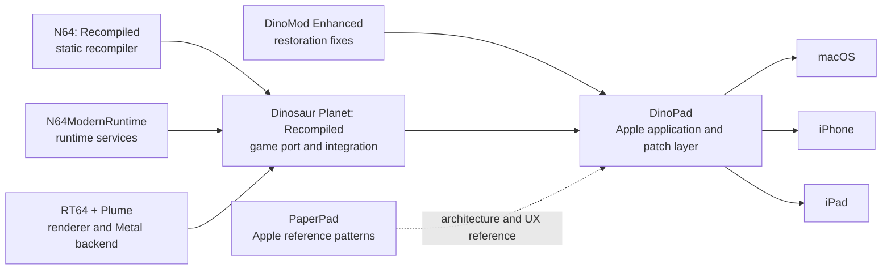
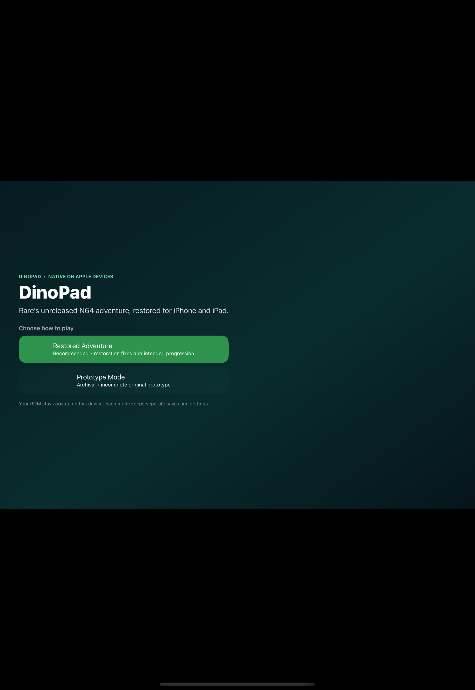
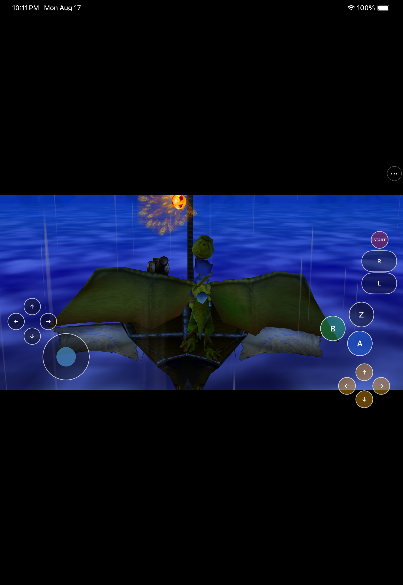

# DinoPad

> A native Apple application for the December 2000 *Dinosaur Planet*
> prototype, built directly on the work of the recompilation community.

> [!IMPORTANT]
> **DinoPad is an Apple-platform integration of
> [Dinosaur Planet: Recompiled](https://github.com/DinosaurPlanetRecomp/dino-recomp),
> not an independent reimplementation of its work.** The game-specific static
> recompilation and core integration come from that project. Restored Adventure
> uses work from
> [DinoMod Enhanced](https://github.com/EoinODoodles/dinomod-enhanced-recompiled).
> DinoPad's contribution is the native macOS/iOS/iPadOS application layer,
> Apple portability work, product experience, touch controls, lifecycle and
> packaging integration described below. Every upstream project retains its
> authorship, license, and rights boundary.


DinoPad turns the existing *Dinosaur Planet* static-recompilation stack into a
native Apple app for Apple Silicon Mac, iPhone, and iPad. It provides a
ROM-import flow, two clearly separated play modes, a UIKit/AppKit home screen,
complete N64 touch controls, settings and diagnostics, save isolation, and
Apple-specific runtime hardening. It is not an emulator, does not use JIT
compilation, and does not download or execute game or mod code at runtime.

## Built on community work

The shortest honest description of the project is:

**Dinosaur Planet: Recompiled supplies the game port; DinoMod Enhanced supplies
the restoration work; N64Recomp, N64ModernRuntime, and RT64 supply the core
technology; PaperPad supplied proven Apple-product patterns; DinoPad integrates
and adapts that stack into the Apple applications in this repository.**

| Project | What that project provides | Relationship to DinoPad |
|---|---|---|
| [Dinosaur Planet: Recompiled](https://github.com/DinosaurPlanetRecomp/dino-recomp) | The base *Dinosaur Planet* static-recompilation project: game-specific recompiled code, runtime integration, launcher foundation, rendering integration, and mod support. | **Direct foundation.** DinoPad builds the pinned v0.3.0 source and carries replayable Apple patches around it. DinoPad does not claim authorship of the base recompilation. |
| [DinoMod Enhanced](https://github.com/EoinODoodles/dinomod-enhanced-recompiled) | Community restoration work for the December 2000 prototype, including fixes for bugs and progression blockers. | **Restored Adventure foundation.** DinoPad statically integrates the pinned v0.9.3 restoration for constrained Apple runtimes. The restoration design and fixes remain DinoMod's work. Public redistribution is blocked pending permission or a compatible published license. |
| [PaperPad](https://github.com/chrissotraidis/paperpad) | An earlier Apple static-recompilation project with native macOS, iPhone, and iPad shell patterns: setup, touch controls, lifecycle, settings, and testing. | **Apple reference implementation.** DinoPad adapts architectural and UX patterns to a different game and upstream stack. It does not use Paper Mario game code, art, assets, or branding. |
| [N64: Recompiled](https://github.com/N64Recomp/N64Recomp) | The general-purpose toolchain that statically recompiles supported N64 programs. | **Core upstream technology, inherited through Dino Recompiled.** DinoPad did not create the recompiler. |
| [N64ModernRuntime](https://github.com/N64Recomp/N64ModernRuntime) | Shared runtime services used by modern N64 recompilation projects. | **Core upstream runtime, inherited through Dino Recompiled.** DinoPad maintains opt-in patches for static mods, separate profiles, restartable sessions, and mobile no-dynamic-code policy. |
| [RT64](https://github.com/rt64/rt64) and its Plume backend | The modern renderer, including the Metal backend used on Apple hardware. | **Core upstream renderer, inherited through Dino Recompiled.** RT64 already supported Metal and macOS; DinoPad does not claim that work. DinoPad maintains iOS/iPadOS, UIKit, cross-build, and lifecycle patches needed by this app. |

Exact versions, commits, dependency relationships, patch order, and patch
hashes are recorded in [the upstream inventory](docs/UPSTREAM.md) and
[`dependencies.lock.json`](dependencies.lock.json). Those records are the
source of truth; names in this README are not a substitute for original
licenses or notices.

### Apple platform history

“Apple support” can mean a renderer backend, a reusable runtime, or a complete
game application. Those are not equivalent. The following table describes the
published documentation and checked-out source at DinoPad's exact pins; it is
not a claim about every later fork or unrecorded experiment.

| Upstream at the pinned version | macOS | iOS | iPadOS |
|---|---|---|---|
| Dinosaur Planet: Recompiled v0.3.0 | No official app target was documented; upstream build instructions covered Windows and Linux. | No official app target documented. | No official app target documented. |
| DinoMod Enhanced v0.9.3 | A mod for Dino Recompiled, not a standalone app; its build prerequisites covered Windows and Linux. | No native app target documented. | No native app target documented. |
| PaperPad at `644945d` | **Yes.** Native Apple Silicon macOS was part of the reference project. | **Yes.** iPhone app and Simulator/device validation were documented. | **Yes.** iPad app and Simulator/device validation were documented. |
| RT64 renderer | **Yes.** RT64 already provided Metal/macOS rendering support. | Not a complete game app; iOS was not listed as a supported application platform at the pin. | Not a complete game app; iPadOS was not listed as a supported application platform at the pin. |

Therefore, DinoPad's Apple work should not be described as inventing static
recompilation, restoration, RT64, Metal rendering, or the original Apple-shell
ideas. Its contribution is making this particular game stack work as a
coherent macOS/iPhone/iPad product, including the mobile renderer adaptations
and runtime policies that the pinned base project did not provide.



## What DinoPad adds

DinoPad's maintained work in this repository is the integration layer around
those upstreams:

- native AppKit/UIKit setup, ROM import, replacement, and private storage;
- a dinosaur-themed launcher with **Restored Adventure** and warned
  **Prototype Mode** choices;
- complete N64 touch input, controller handoff, editable phone/tablet layouts,
  and a persistent in-game menu;
- Metal-window, iOS renderer, mobile sampler, cross-compilation, thread,
  autorelease, audio, and session-lifecycle fixes;
- static restoration dispatch with no JIT, no runtime code writes, no writable
  mod scanning, and no arbitrary mod installation;
- separate saves and settings for Restored and Prototype sessions;
- native settings, ROM management, diagnostics sharing, quit-to-home, and
  restartable in-process play sessions;
- reproducible dependency pins, a locked 26-file patch set, ROM-free package
  checks, smoke tests, and evidence-backed platform status.

All maintained upstream changes live as reviewable patches under
[`patches/`](patches/). Reference checkouts under `ref/` are ignored,
reproducible, and push-disabled; DinoPad does not silently rewrite upstream
history.

## Current experience

One app presents two isolated ways to explore the prototype:

- **Restored Adventure** is the recommended path. It uses the pinned DinoMod
  Enhanced restoration through statically linked, no-write dispatch.
- **Prototype Mode** is the archival path. It preserves the original incomplete
  experience and requires an explicit warning before launch.

Both modes keep separate saves and settings. On iPhone and iPad, DinoPad opens
with a native launcher and Files-based ROM importer, then provides touch
controls, controller handoff, a persistent `•••` menu, layout editing,
settings, ROM management, diagnostics, and quit-to-home. The macOS app uses the
same mode policy with a native launcher plus keyboard and controller support.

<p align="center">
  
  
  
</p>

Screenshots are compatibility evidence captured from a locally supplied copy
of the game. They do not indicate ownership of the depicted game content.

## Project status

| Target | Verified development state |
|---|---|
| macOS arm64 | Native app bundle, RT64 Metal rendering, audio, keyboard input, ROM import, both modes, save persistence, and clean shutdown. |
| iPhone Simulator arm64 | Native launcher/importer, complete touch shell, Restored gameplay, save-preserving relaunch, and a bounded 600-second run. |
| iPad Simulator arm64 | Tablet launcher, independent layout persistence, complete product matrix, save relaunch, and a bounded 600-second run. |
| Physical iPhone/iPad | ROM-free arm64 device build and archive compile, but installation and runtime validation remain blocked by the lack of a connected test device and signing identity. |

These are engineering results, not a release announcement. See
[Status](docs/STATUS.md), [UI parity](docs/UI_PARITY.md), and the
[playtest matrix](docs/PLAYTEST_MATRIX.md) for the evidence behind each claim.

> [!WARNING]
> **There is no public DinoPad release.** Physical-device validation,
> start-to-credits testing, licensing and notice review, DinoMod permission,
> and game-derived AOT redistribution rights remain open release gates.

## Requirements

- Apple Silicon Mac running macOS 11 or later
- Xcode with macOS and iOS Simulator SDKs
- CMake 3.20+, Ninja, Git, Python 3, and `make`
- a MIPS-capable Clang toolchain for private generation
- at least 20 GiB of available disk space
- a legally obtained, unmodified 64 MiB December 2000 *Dinosaur Planet*
  prototype ROM

DinoPad accepts `.z64`, `.v64`, and `.n64` byte orders. It normalizes the input
locally, verifies the single supported prototype, and stores the accepted ROM
only in private app storage. A different revision, modified image, or wrong
size is rejected.

## Building for local development

Follow [the complete build guide](docs/BUILDING.md) for toolchain setup, pinned
dependency bootstrap, private generation, safety audits, outputs, and Simulator
smoke tests.

Once the private generation prerequisites are available, the primary commands
are:

```sh
scripts/build-macos-app.sh --rom /absolute/path/to/your/rom
scripts/build-ios-simulator.sh
scripts/build-ios-device.sh
```

The macOS command creates `build-macos/DinoPad.app`. The iOS commands create
ROM-free local development apps for Simulator or an unsigned `iphoneos`
target. A personal development team may be specified for local device testing;
this is not a distribution workflow.

Never add a ROM, save, generated game code, private fixture, signing material,
or local absolute path to the repository. Run the package checks in the build
guide before treating any local artifact as testable.

## Known limitations

- No physical iPhone or iPad runtime evidence exists yet.
- A full Restored start-to-credits playthrough and chapter-boundary matrix are
  still open.
- Real controller reconnect, rumble, Bluetooth audio, thermal behavior, memory
  pressure, interruption handling, and update preservation need physical
  hardware validation.
- The archival prototype is unfinished and can contain progression blockers.
- Individual touch controls are not yet exposed as separate accessibility
  elements.
- No public binary, IPA, source release, or redistribution package is
  authorized.

Read [Known issues](docs/KNOWN_ISSUES.md) and
[technical debt](docs/TECHNICAL_DEBT.md) for the full evidence-linked record.

## Frequently asked questions

### Is DinoPad a fork of Dinosaur Planet: Recompiled?

DinoPad is an Apple integration built from a pinned checkout of Dinosaur
Planet: Recompiled, with a maintained patch series and a new native product
shell around it. “Fork” is directionally correct, but incomplete: this
repository intentionally stores adapters and replayable patches rather than a
silent copy of the entire upstream tree.

### Who made the recompilation and restoration?

The [Dinosaur Planet: Recompiled](https://github.com/DinosaurPlanetRecomp/dino-recomp)
contributors made the base game recompilation project. The
[DinoMod Enhanced](https://github.com/EoinODoodles/dinomod-enhanced-recompiled)
contributors made the restoration fixes used by Restored Adventure. DinoPad
credits and depends on both; it does not rebrand their work as its own.

### Did DinoPad bring RT64 or Metal to macOS?

No. [RT64](https://github.com/rt64/rt64) already supported Metal and macOS.
DinoPad adapts that renderer and the surrounding game/runtime stack for this
specific Apple application, and carries mobile, UIKit, cross-build, and
lifecycle patches needed for iPhone and iPad.

### What is static recompilation?

Static recompilation translates the supported N64 program into native arm64
code before the app is built. DinoPad runs that generated code with
N64ModernRuntime and RT64; it does not emulate an N64 and does not generate
executable code at runtime.

### Can DinoPad run another ROM or a patched ROM?

No. DinoPad supports exactly one December 2000 prototype and verifies the
normalized input before accepting it. The ROM is never bundled, uploaded,
downloaded, or shared by DinoPad.

### Is Restored Adventure a public DinoMod release?

No. Its static integration is development evidence only. DinoPad cannot
publish a Restored build while DinoMod permission and the other rights, notice,
and package gates remain unresolved.

### Can I download an app or IPA?

Not currently. There is no supported public binary. Source-only local
development remains subject to this repository's rights boundary and every
upstream license.

## Repository guide

| Path | Purpose |
|---|---|
| [`apple/app/`](apple/app/) | Native iOS/iPadOS shell, controls, settings, diagnostics, ROM setup, and lifecycle integration. |
| [`src/app/`](src/app/) | Native macOS home and support integration. |
| [`src/runtime/`](src/runtime/) | DinoPad-owned runtime adapters. |
| [`src/restoration/`](src/restoration/) | Static restoration integration boundary. |
| [`patches/`](patches/) | Ordered, replayable changes against exact upstream pins. |
| [`scripts/`](scripts/) | Bootstrap, build, smoke-test, runtime-guard, and package-safety automation. |
| [`docs/`](docs/) | Architecture, implementation status, upstream inventory, rights analysis, testing, and release gates. |
| [`docs/evidence/`](docs/evidence/) | Curated outputs that support platform and feature claims. |

## Rights, licenses, and distribution

DinoPad is independent and unofficial. It is not affiliated with or endorsed
by Nintendo, Rare, Microsoft, Dinosaur Planet Recompiled, DinoMod Enhanced,
PaperPad, or any of their contributors. Game names, assets, characters,
copyrights, and trademarks belong to their respective owners.

> [!CAUTION]
> **This repository does not currently have one blanket license or a completed
> release-rights determination.** Do not assume that visible source is a grant
> to redistribute the combined project. Each upstream retains its own terms;
> DinoMod permission, GPL combined-work obligations, the DinoPad-owned license
> decision, assembled notices, and rights for locally generated game AOT are
> unresolved release gates.

The tracked repository contains no ROM, save, extracted game asset, generated
playable game source, private fixture, signing identity, or redistributable
Restored package. A ROM-free executable may still contain locally generated
code derived from user-supplied game data; “ROM-free” is a package fact, not a
legal conclusion.

Before sharing source or a build, read:

- [Rights and licensing](docs/RIGHTS_AND_LICENSES.md)
- [Upstream sources and patch strategy](docs/UPSTREAM.md)
- [DinoMod integration and permission boundary](docs/DINOMOD_INTEGRATION.md)
- [Release checklist](docs/RELEASE_CHECKLIST.md)
- [Package-rights inventory](docs/PACKAGE_RIGHTS_INVENTORY.json)

The release gate deliberately fails closed while any required item remains
unresolved.

## Detailed acknowledgements

DinoPad exists because of the work of many upstream communities. In addition
to the directly credited projects above, the pinned build includes work from
[SDL](https://github.com/libsdl-org/SDL),
[RmlUi](https://github.com/mikke89/RmlUi),
[FreeType](https://freetype.org/), and other transitive projects recorded in
[`dependencies.lock.json`](dependencies.lock.json) and the generated
[compiled-dependency inventory](docs/COMPILED_DEPENDENCY_INVENTORY.json).

Thank you to the Dinosaur Planet preservation, decompilation, recompilation,
modding, and tooling contributors whose research and engineering made every
layer of this project possible. DinoPad's documentation should always preserve
that provenance: the Apple app is DinoPad's work; the foundations remain the
work of their original authors.
