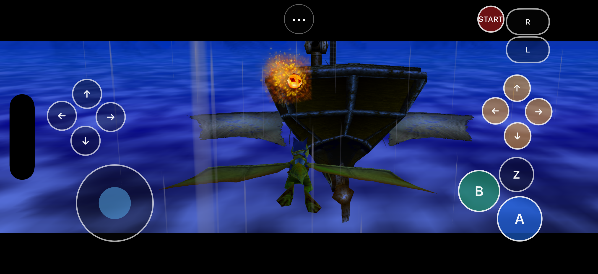
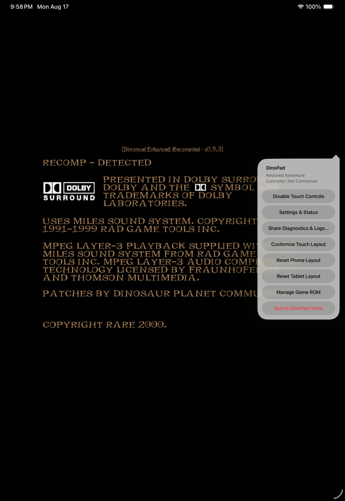
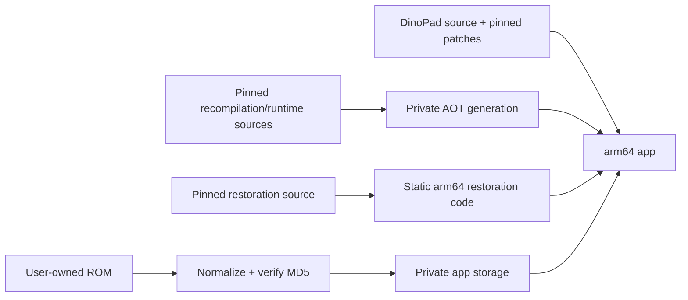

# DinoPad

> A ROM-free, native Apple Silicon port of the December 2000 *Dinosaur Planet*
> prototype for macOS, iPhone, and iPad.




**Development status:** macOS, iPhone Simulator, and iPad Simulator are
playable and evidence-backed. Physical-device validation, progression
certification, redistribution clearance, and public packaging are still open.
There is no supported public download or IPA release.

## What DinoPad is

DinoPad statically recompiles the supported N64 program for arm64 and presents
it through a native Apple shell, RT64's Metal renderer, and the N64ModernRuntime
runtime. It is not an emulator, does not use JIT compilation, and does not
download or execute game or mod code at runtime.

One binary exposes two isolated modes:

- **Restored Adventure** is the recommended default. It uses the pinned DinoMod
  Enhanced v0.9.3 restoration through statically linked, no-write dispatch.
- **Prototype Mode** is the archival base experience. DinoPad shows a warning
  before entering it and keeps its saves and configuration separate.

This repository contains integration source, patches, scripts, documentation,
and test evidence. It contains no ROM, save, generated game source, private
fixture, signing identity, or redistributable Restored package.

## Target status

| Target | Current verified state |
|---|---|
| macOS arm64 | Native app bundle, Metal rendering, audio pipeline, keyboard input, both modes, ROM import, save persistence, and clean shutdown are green. |
| iPhone Simulator arm64 | Phase 5 green: complete native shell/touch matrix, Restored gameplay, a 600-second run, and same-install save relaunch. |
| iPad Simulator arm64 | Phase 6 green: complete tablet matrix, independent layout persistence, a 600-second run, save relaunch, and measured PaperPad parity. |
| Physical iPhone/iPad | Device-arm64 compile is green and ROM-free. Install/runtime validation is blocked because no device or Apple Development identity was available. |
| Public package | Not available. Physical testing, start-to-credits progression, notices, DinoMod permission, packaged-asset provenance, and compiled-AOT redistribution rights remain release blockers. |

The detailed source of truth is [docs/STATUS.md](docs/STATUS.md); verified play
sessions are listed in [docs/PLAYTEST_MATRIX.md](docs/PLAYTEST_MATRIX.md).

## Download status

There is no supported public download, signed app, or unsigned IPA. The source
tree is for development and verification while physical-device, progression,
rights, and package gates remain open.

## Requirements

- Apple Silicon Mac running macOS 11 or newer
- Xcode with the macOS and iOS SDKs (Xcode 26.6 is the verified toolchain)
- CMake 3.20+, Ninja, Git, Python 3, and `make`
- A MIPS-capable Clang toolchain for the private generation step
- At least 20 GiB of free disk space
- A legally obtained, unmodified 64 MiB December 2000 prototype ROM

The supported ROM normalizes to MD5
`49f7bb346ade39d1915c22e090ffd748`. DinoPad accepts `.z64`, `.v64`, and
`.n64` byte orders, then validates the normalized bytes before storing them
privately.

## Build from source

The first macOS build bootstraps exact upstream pins, applies the maintained
patch series, validates the private ROM, and generates ignored AOT source:

```sh
scripts/build-macos-app.sh --rom /absolute/path/to/your/rom
```

After private generation exists, incremental targets are:

```sh
scripts/build-macos-app.sh
scripts/build-ios-simulator.sh
scripts/build-ios-device.sh
```

The device command produces an unsigned app by default. It can request personal
development signing with `--team TEAM_ID`, but the signed install/device matrix
has not yet been validated. See [docs/BUILDING.md](docs/BUILDING.md) for the
toolchain, signing options, exact outputs, and smoke commands.

## First launch

On iPhone and iPad, DinoPad opens a native setup screen and Files picker before
starting SDL or the game runtime. Importing performs all of the following:

1. checks the exact 64 MiB size;
2. normalizes z64/v64/n64 byte order;
3. verifies the supported MD5;
4. writes atomically into protected, backup-excluded app storage.

Use `•••` → **Manage Game ROM** to replace or remove the imported ROM. Invalid
files are rejected without being staged. macOS provides the same fingerprint
and normalization policy through its native setup flow.

## Touch, menu, keyboard, and controller

The iPhone/iPad overlay includes the analog stick and all N64 digital controls:
A, B, Z, L, R, Start, D-pad, and C-buttons. It supports simultaneous touches,
phone/tablet-specific persisted layouts, move/resize/opacity/visibility edits,
linked directional groups, undo, reset, Done, and Cancel. The persistent `•••`
button reaches settings, diagnostics sharing, ROM management, layout editing,
and quit-to-home.

Default macOS keyboard mappings:

| N64 input | Keyboard |
|---|---|
| Analog stick | W A S D |
| A / B | Space / Left Shift |
| Z / L / R | Q / E / R |
| Start | Return |
| C-buttons | Arrow keys |
| D-pad | I J K L |
| Menu | Escape |

The SDL controller mapping path passes its isolated virtual-controller test.
Real controller reconnect, rumble, and controller-centric play remain unverified
on physical Apple hardware.

## Screenshots and native product surfaces



## What works

The Simulator-tested shell includes:

- a Restored-first home and warned Prototype path;
- Files-based ROM import, replacement, and removal;
- independent Restored/Prototype saves and settings;
- live touch, volume, resolution, aspect, refresh-rate, and HUD settings;
- bounded protected diagnostics with path redaction and a native share sheet;
- lifecycle input clearing and same-process quit-to-home/runtime restart.

Diagnostics retain a 4 MiB current log plus one predecessor, sanitize complete
lines before persistence, and cap shared reports at 512 KiB. They intentionally
exclude ROM and save contents.

## ROM-free, static pipeline



Generated game source, imported ROMs, saves, and sanitized restoration package
output remain ignored/private. The iOS target excludes LiveRecomp and SLJIT,
refuses writable mod discovery, and packages no executable mod payload. See
[docs/ARCHITECTURE.md](docs/ARCHITECTURE.md) and
[docs/UPSTREAM.md](docs/UPSTREAM.md) for the exact pins and patch inventory.

“ROM-free” is a technical content boundary, not a redistribution-rights
conclusion. Development executables statically contain locally generated AOT
derived from the user-supplied game program. The package-specific engineering
inventory and its fail-closed rights gate are documented in
[docs/PACKAGE_RIGHTS_INVENTORY.json](docs/PACKAGE_RIGHTS_INVENTORY.json) and
[docs/RIGHTS_AND_LICENSES.md](docs/RIGHTS_AND_LICENSES.md).

## Evidence and stability

The current strongest automated evidence is:

- [iPhone Simulator Phase 5](docs/evidence/2026-08-17/iphone-phase5/): 600
  seconds of live Restored gameplay plus save-preserving relaunch.
- [iPad Simulator Phase 6](docs/evidence/2026-08-17/ipad-simulator-phase6/):
  complete tablet product matrix plus 600-second gameplay/relaunch.
- [Physical-device preflight](docs/evidence/2026-08-17/physical-device-preflight/):
  unsigned arm64 `iphoneos` output, ROM-free and free of signing artifacts.
- [macOS automated smoke](docs/evidence/2026-08-16/macos-smoke/): gameplay,
  input, and clean shutdown.

These runs support “playable on the verified targets,” not “complete” or
“start-to-credits.” Only one early-game progression fixture is catalogued.

## Known limitations

- No physical iPhone or iPad runtime evidence exists yet.
- Speaker/headphone/Bluetooth listening tests and real controller tests are open.
- No Restored start-to-credits playthrough or chapter-boundary matrix exists.
- Physical orientation, sustained thermals, memory pressure, interruptions, and
  in-place update preservation remain unverified.
- Canvas-drawn touch controls are not yet individual accessibility elements;
  the persistent menu button is accessible.
- The prototype's name-entry cursor has documented upstream navigation quirks.
- DinoMod redistribution permission, compiled game-AOT rights, several macOS
  launcher asset/font provenance items, and the complete transitive
  license/notice set are unresolved, so no public binary is authorized.

See [docs/KNOWN_ISSUES.md](docs/KNOWN_ISSUES.md) and
[docs/TECHNICAL_DEBT.md](docs/TECHNICAL_DEBT.md) for the full register.

## Installation guide and releases

There is currently no release artifact to install. Developers can build the
macOS app or an unsigned device app from source using the commands above. Do not
publish or redistribute a DinoPad binary until the Phase 10 checklist, physical
device gates, third-party notices, and DinoMod permission gate are complete.
The live gate status and artifact stop conditions are in
[docs/RELEASE_CHECKLIST.md](docs/RELEASE_CHECKLIST.md).

## Rights and credits

DinoPad is an independent, unofficial project and is not affiliated with or
endorsed by Nintendo, Rare, Microsoft, Dinosaur Planet Recompiled, DinoMod,
PaperPad, or their contributors. Game names, characters, assets, copyrights,
and trademarks remain with their respective owners. Users must supply their own
legally obtained supported game data.

The project builds on pinned work from
[Dino Recompiled](https://github.com/DinosaurPlanetRecomp/dino-recomp),
[DinoMod Enhanced](https://github.com/EoinODoodles/dinomod-enhanced-recompiled),
[PaperPad](https://github.com/chrissotraidis/paperpad), N64Recomp,
N64ModernRuntime, RT64, Plume, SDL, and their transitive dependencies. Each
retains its own license and rights boundary. Read
[docs/RIGHTS_AND_LICENSES.md](docs/RIGHTS_AND_LICENSES.md) before redistributing
source or a build.
