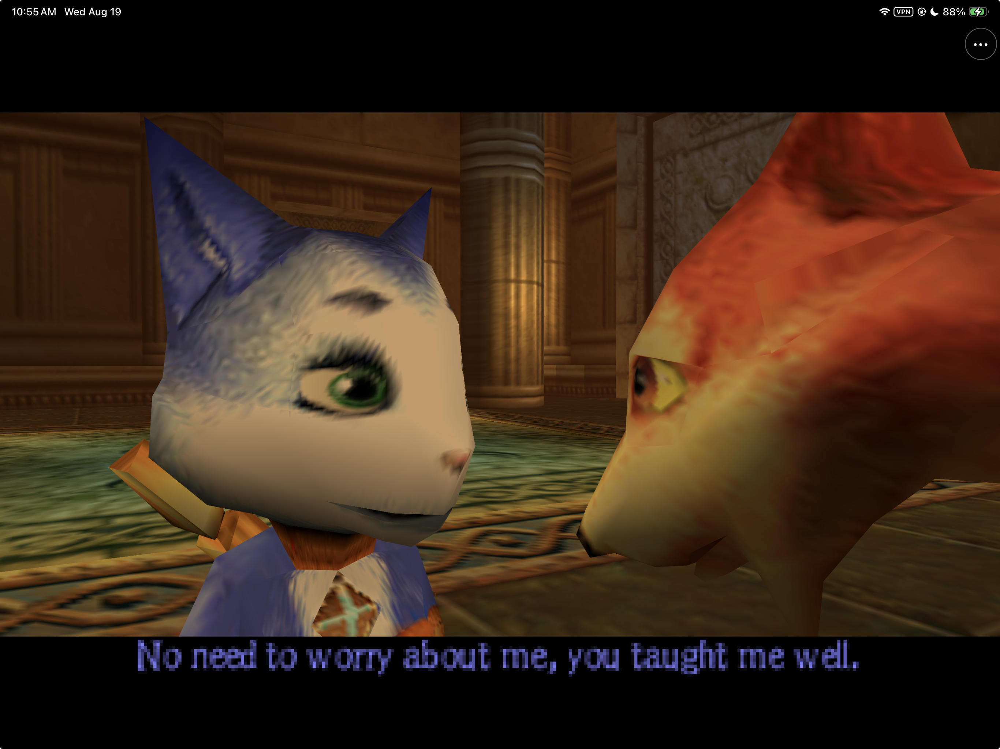
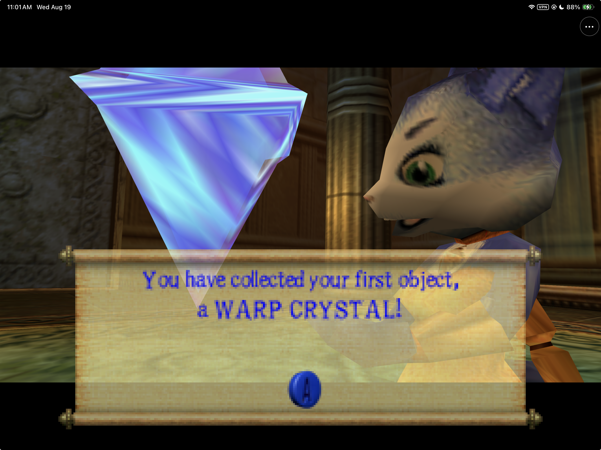
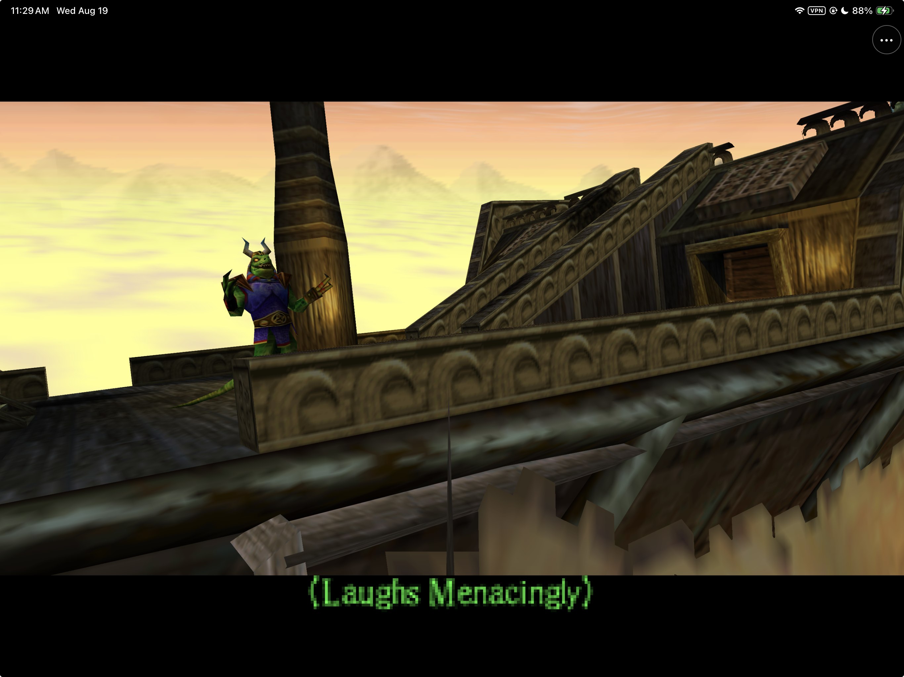
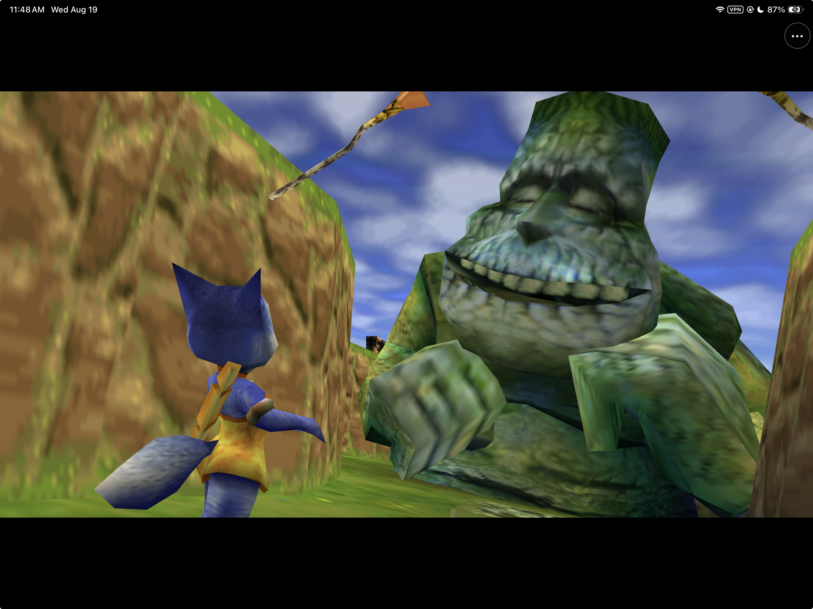
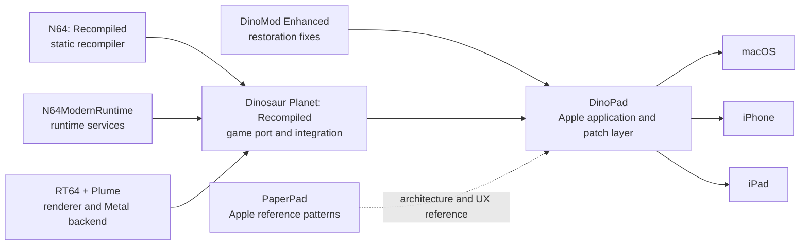

# DinoPad

<p align="center">
  
</p>

> A native Apple application for the December 2000 *Dinosaur Planet*
> prototype, built directly on the work of the recompilation community.

> [!WARNING]
> **Public DinoPad IPAs, including 0.1.0, 0.1.1, and 0.1.2, contain Prototype Mode only.** They do not
> contain DinoMod Enhanced or Restored Adventure because DinoMod redistribution
> permission has not been granted. Screenshots of Restored Adventure on this
> page document private development work; they are not features of the public
> downloads.

> [!IMPORTANT]
> **DinoPad is an Apple-platform integration of
> [Dinosaur Planet: Recompiled](https://github.com/DinosaurPlanetRecomp/dino-recomp),
> not an independent reimplementation of its work.** The game-specific static
> recompilation and core integration come from that project. Restored Adventure
> uses work from
> [DinoMod Enhanced](https://github.com/EoinODoodles/dinomod-enhanced-recompiled).
> DinoPad's contribution is the native macOS/iOS/iPadOS application layer,
> Apple portability work, product experience, touch controls, lifecycle and
> packaging integration described below. Every upstream project retains its
> authorship, license, and rights boundary.


DinoPad turns the existing *Dinosaur Planet* static-recompilation stack into a
native Apple app for Apple Silicon Mac, iPhone, and iPad. Private development
builds provide two clearly separated play modes; public IPAs provide
Prototype Mode only. DinoPad includes a ROM-import flow, a UIKit/AppKit home screen,
complete N64 touch controls, settings and diagnostics, save isolation, and
Apple-specific runtime hardening. It is not an emulator, does not use JIT
compilation, and does not download or execute game or mod code at runtime.

## Gameplay

<p align="center">
  
  
</p>
<p align="center">
  
  
</p>

Captured from Restored Adventure running natively on a physical iPad with a
locally supplied copy of the game. DinoPad does not include or distribute game
data.

## Built on community work

The shortest honest description of the project is:

**Dinosaur Planet: Recompiled supplies the game port; DinoMod Enhanced supplies
the restoration work; N64Recomp, N64ModernRuntime, and RT64 supply the core
technology; PaperPad supplied proven Apple-product patterns; DinoPad integrates
and adapts that stack into the Apple applications in this repository.**

| Project | What that project provides | Relationship to DinoPad |
|---|---|---|
| [Dinosaur Planet: Recompiled](https://github.com/DinosaurPlanetRecomp/dino-recomp) | The base *Dinosaur Planet* static-recompilation project: game-specific recompiled code, runtime integration, launcher foundation, rendering integration, and mod support. | **Direct foundation.** DinoPad builds the pinned v0.3.0 source and carries replayable Apple patches around it. DinoPad does not claim authorship of the base recompilation. |
| [DinoMod Enhanced](https://github.com/EoinODoodles/dinomod-enhanced-recompiled) | Community restoration work for the December 2000 prototype, including fixes for bugs and progression blockers. | **Restored Adventure foundation.** DinoPad statically integrates the pinned v0.9.3 restoration for constrained Apple runtimes. The restoration design and fixes remain DinoMod's work. Public redistribution is blocked pending permission or a compatible published license. |
| [PaperPad](https://github.com/chrissotraidis/paperpad) | An earlier Apple static-recompilation project with native macOS, iPhone, and iPad shell patterns: setup, touch controls, lifecycle, settings, and testing. | **Apple reference implementation.** DinoPad adapts architectural and UX patterns to a different game and upstream stack. It does not use Paper Mario game code, art, assets, or branding. |
| [N64: Recompiled](https://github.com/N64Recomp/N64Recomp) | The general-purpose toolchain that statically recompiles supported N64 programs. | **Core upstream technology, inherited through Dino Recompiled.** DinoPad did not create the recompiler. |
| [N64ModernRuntime](https://github.com/N64Recomp/N64ModernRuntime) | Shared runtime services used by modern N64 recompilation projects. | **Core upstream runtime, inherited through Dino Recompiled.** DinoPad maintains opt-in patches for static mods, separate profiles, restartable sessions, and mobile no-dynamic-code policy. |
| [RT64](https://github.com/rt64/rt64) and its Plume backend | The modern renderer, including the Metal backend used on Apple hardware. | **Core upstream renderer, inherited through Dino Recompiled.** RT64 already supported Metal and macOS; DinoPad does not claim that work. DinoPad maintains iOS/iPadOS, UIKit, cross-build, and lifecycle patches needed by this app. |

Exact versions, commits, dependency relationships, patch order, and patch
hashes are recorded in [the upstream inventory](docs/UPSTREAM.md) and
[`dependencies.lock.json`](dependencies.lock.json). Those records are the
source of truth; names in this README are not a substitute for original
licenses or notices.

### Apple platform history

“Apple support” can mean a renderer backend, a reusable runtime, or a complete
game application. Those are not equivalent. The following table describes the
published documentation and checked-out source at DinoPad's exact pins; it is
not a claim about every later fork or unrecorded experiment.

| Upstream at the pinned version | macOS | iOS | iPadOS |
|---|---|---|---|
| Dinosaur Planet: Recompiled v0.3.0 | No official app target was documented; upstream build instructions covered Windows and Linux. | No official app target documented. | No official app target documented. |
| DinoMod Enhanced v0.9.3 | A mod for Dino Recompiled, not a standalone app; its build prerequisites covered Windows and Linux. | No native app target documented. | No native app target documented. |
| PaperPad at `644945d` | **Yes.** Native Apple Silicon macOS was part of the reference project. | **Yes.** iPhone app and Simulator/device validation were documented. | **Yes.** iPad app and Simulator/device validation were documented. |
| RT64 renderer | **Yes.** RT64 already provided Metal/macOS rendering support. | Not a complete game app; iOS was not listed as a supported application platform at the pin. | Not a complete game app; iPadOS was not listed as a supported application platform at the pin. |

Therefore, DinoPad's Apple work should not be described as inventing static
recompilation, restoration, RT64, Metal rendering, or the original Apple-shell
ideas. Its contribution is making this particular game stack work as a
coherent macOS/iPhone/iPad product, including the mobile renderer adaptations
and runtime policies that the pinned base project did not provide.



## What DinoPad adds

DinoPad's maintained work in this repository is the integration layer around
those upstreams:

- native AppKit/UIKit setup, ROM import, replacement, and private storage;
- a dinosaur-themed development launcher with **Restored Adventure** and warned
  **Prototype Mode** choices, plus a Prototype-only public configuration;
- complete N64 touch input, controller handoff, editable phone/tablet layouts,
  and a persistent in-game menu;
- Metal-window, iOS renderer, mobile sampler, cross-compilation, thread,
  autorelease, audio, and session-lifecycle fixes;
- static restoration dispatch with no JIT, no runtime code writes, no writable
  mod scanning, and no arbitrary mod installation;
- separate saves and settings for Restored and Prototype sessions;
- native settings, ROM management, diagnostics sharing, quit-to-home, and
  restartable in-process play sessions;
- reproducible dependency pins, a locked 28-file patch set, ROM-free package
  checks, smoke tests, and evidence-backed platform status.

All maintained upstream changes live as reviewable patches under
[`patches/`](patches/). Reference checkouts under `ref/` are ignored,
reproducible, and push-disabled; DinoPad does not silently rewrite upstream
history.

## Current experience

The private Restored build presents two isolated ways to explore the prototype:

- **Restored Adventure** is the recommended path. It uses the pinned DinoMod
  Enhanced restoration through statically linked, no-write dispatch.
- **Prototype Mode** is the archival path. It preserves the original incomplete
  experience and requires an explicit warning before launch.

Public IPAs expose only Prototype Mode. In a private Restored build,
both modes keep separate saves and settings. On iPhone and iPad, DinoPad opens
with a native launcher and Files-based ROM importer, then provides touch
controls, controller handoff, a persistent `•••` menu, layout editing,
settings, ROM management, diagnostics, and quit-to-home. The macOS app uses the
same mode policy with a native launcher plus keyboard and controller support.

## Project status

| Target | Verified development state |
|---|---|
| macOS arm64 | Native app bundle, RT64 Metal rendering, audio, native launcher and ROM import, isolated modes/saves, controller support, desktop keyboard/mouse defaults, windowed/fullscreen switching, and clean shutdown. |
| iPhone Simulator arm64 | Native launcher/importer, complete touch shell, Restored gameplay, save-preserving relaunch, and a bounded 600-second run. |
| iPad Simulator arm64 | Tablet launcher, independent layout persistence, complete product matrix, save relaunch, and a bounded 600-second run. |
| Physical iPhone/iPad | Signed arm64 builds installed in place with private ROMs, saves, and settings preserved. Restored Adventure has been exercised on both form factors; physical-iPad controller play and reconnect are working. The full duration/audio/thermal/update matrix is still open. |

These are engineering results beyond the narrower public base build. See
[Status](docs/STATUS.md), [UI parity](docs/UI_PARITY.md), and the
[playtest matrix](docs/PLAYTEST_MATRIX.md) for the evidence behind each claim.

> [!NOTE]
> **[DinoPad 0.1.2](https://github.com/chrissotraidis/dinopad/releases/tag/v0.1.2)
> publishes the audited DinoMod-free base IPA.** It contains Prototype Mode
> only, is unsigned, and must be re-signed before installation. Publishing
> Restored Adventure still requires a redistribution grant from DinoMod's
> rightsholders.

## Playing the public 0.1.2 IPA

The release download is named **`DinoPad-0.1.2-prototype-only-unsigned.ipa`**.
It is ROM-free and unsigned: it cannot be installed by tapping the file. Before
installation, use your own Apple signing method to sign the IPA, then install
the signed result on an iPhone or iPad running iOS/iPadOS 15 or later. DinoPad
does not provide certificates, provisioning profiles, or a signing service.

After installation:

1. Put your supported *Dinosaur Planet* dump in Files, iCloud Drive, or another
   location visible to the Apple file picker.
2. Launch DinoPad and select the dump when prompted. The expected original file
   is commonly named **`rom`** with no extension. Do **not** select
   **`rom_crack.z64`**.
3. DinoPad verifies and privately imports the file. A renamed, modified, or
   wrong-revision image is rejected.
4. From DinoPad Home, choose **Start Dinosaur Planet**, acknowledge the archival
   warning, and play. The public app has no Restored Adventure selector.

The imported ROM, saves, settings, and touch layouts remain in DinoPad's private
app container. Updating the same bundle in place is intended to preserve that
container; deleting the app deletes its local data, so back up anything
important before removing it.

### Restored Adventure: private self-build

The public IPA cannot be converted to Restored Adventure by importing an
`.nrm` file. DinoPad's iOS/iPadOS port uses ahead-of-time native code and does
not permit JIT or runtime executable mod loading. DinoMod Enhanced must
therefore be compiled into a separate app and signed by the person building it.

Users who obtain DinoMod Enhanced **v0.9.3** from its
[official project](https://github.com/EoinODoodles/dinomod-enhanced-recompiled)
may create a private Restored build from source:

```sh
git clone https://github.com/chrissotraidis/dinopad.git
cd dinopad

# macOS host prerequisites
brew install cmake ninja xdelta
scripts/bootstrap.sh
scripts/build-tools.sh

# DinoMod's private asset-generation environment
python3 -m venv .goal-loop/dinomod-venv
.goal-loop/dinomod-venv/bin/pip install \
  -r ref/dinomod-enhanced-recompiled/requirements.txt

# Use the exact original big-endian dump described below.
mkdir -p ref/DINO
cp /absolute/path/to/your/original/rom ref/DINO/rom
scripts/generate-base.sh --rom ref/DINO/rom
scripts/generate-restoration.sh

# Build native host shader tools, then the private Restored device app.
cmake -S . -B build-macos -G Ninja -DCMAKE_BUILD_TYPE=Release
cmake --build build-macos --target DinoPad
scripts/build-ios-device.sh --distribution restored \
  --team YOUR10CHARTEAMID --allow-provisioning-updates
```

The signed app is produced at
`build-ios-device/Release-iphoneos/DinoPad.app` and can be installed with Xcode
or `xcrun devicectl`. An unsigned private candidate can instead be built without
`--team` and packaged with
`scripts/package-ios.sh --candidate --distribution restored`; it still must be
signed before installation. Generated DinoMod code/data and a Restored IPA are
for the user's private build only and must not be redistributed without
DinoMod permission. Installing the private build over the same DinoPad bundle
is intended to preserve the existing app container, including Prototype saves
and settings; do not delete the installed app first.

### Required game dump (exact build)

DinoPad supports only the original, unmodified **December 1, 2000** prototype
build. The supported dump identifies itself as `DINO PLANET`, game code
`NDPE`, revision 0, and is exactly 64 MiB (67,108,864 bytes).

The original big-endian dump used by the upstream project is conventionally
named **`rom`** with no filename extension. Some reference sets place a
modified **`rom_crack.z64`** beside it; **do not select `rom_crack.z64`**.
DinoPad requires the original `rom` data and deliberately rejects that patched
emulator/flash-cart image.

To verify a copy without sharing it, calculate the MD5 of the original
big-endian file. The supported fingerprint is:

```text
49f7bb346ade39d1915c22e090ffd748
```

DinoPad also accepts `.z64`, `.v64`, and `.n64` byte orders whose normalized
data matches that fingerprint; the filename itself is not trusted. DinoPad
normalizes and validates the selected file locally, then stores the accepted
copy only in private app storage. This project does not provide or link to
game-data downloads.

## Developer build requirements

- Apple Silicon Mac running macOS 11 or later
- Xcode with macOS and iOS Simulator SDKs
- CMake 3.20+, Ninja, Git, Python 3, and `make`
- a MIPS-capable Clang toolchain for private generation
- at least 20 GiB of available disk space
- the supported game dump described above

## Controls

Xbox-style controllers use the ordinary N64 layout: left stick moves, the
south face button is A, the west face button is B, the triggers provide Z/R,
the left bumper is L, the right stick provides the C buttons, and Menu is
Start. iPhone and iPad additionally provide independent, editable touch
layouts that disappear automatically while a controller is active.
On touch screens, holding Z for half a second locks targeting until the next Z
tap; **Settings & Status > Hold Z to Lock Targeting** can disable that behavior.

The default macOS keyboard and mouse layout is:

| N64 input | macOS default |
|---|---|
| Analog stick | `W` `A` `S` `D` |
| A / B | Left click or `Space` / right click or `X` |
| Z | Left or right `Shift` |
| C buttons | `Q` left, `E` right, `R` up, `F` down |
| D-pad | Arrow keys |
| L / R | `Z` / `C` |
| Start | `Escape` or `` ` `` |
| DinoPad settings menu | `Tab` |
| Fullscreen | `F11` or `Option`+`Return` |

Bindings remain editable in the in-game controls screen. Existing development
profiles keep their saved bindings until **Reset Keyboard Bindings** is used.

## Building for local development

Follow [the complete build guide](docs/BUILDING.md) for toolchain setup, pinned
dependency bootstrap, private generation, safety audits, outputs, and Simulator
smoke tests.

Once the private generation prerequisites are available, the primary commands
are:

```sh
scripts/build-macos-app.sh --rom /absolute/path/to/your/rom
scripts/build-ios-simulator.sh
scripts/build-ios-device.sh
```

The macOS command creates `build-macos/DinoPad.app`. The iOS commands create
ROM-free local development apps for Simulator or an unsigned `iphoneos`
target. A personal development team may be specified for local device testing;
this is not a distribution workflow.

Never add a ROM, save, generated game code, private fixture, signing material,
or local absolute path to the repository. Run the package checks in the build
guide before treating any local artifact as testable.

## Known limitations

- A full Restored start-to-credits playthrough and chapter-boundary matrix are
  still open.
- Controller reconnect is working on the tested physical iPad, but rumble,
  Bluetooth audio, thermal behavior, memory pressure, interruption handling,
  and the full update-preservation matrix still need broader hardware coverage.
- The archival prototype is unfinished and can contain progression blockers.
- Individual touch controls are not yet exposed as separate accessibility
  elements.
- The public-package configuration currently contains the original Prototype
  experience only. Restored Adventure remains development-only until DinoMod
  publishes compatible terms or grants redistribution permission.

Read [Known issues](docs/KNOWN_ISSUES.md) and
[technical debt](docs/TECHNICAL_DEBT.md) for the full evidence-linked record.

## Frequently asked questions

### Is DinoPad a fork of Dinosaur Planet: Recompiled?

DinoPad is an Apple integration built from a pinned checkout of Dinosaur
Planet: Recompiled, with a maintained patch series and a new native product
shell around it. “Fork” is directionally correct, but incomplete: this
repository intentionally stores adapters and replayable patches rather than a
silent copy of the entire upstream tree.

### Who made the recompilation and restoration?

The [Dinosaur Planet: Recompiled](https://github.com/DinosaurPlanetRecomp/dino-recomp)
contributors made the base game recompilation project. The
[DinoMod Enhanced](https://github.com/EoinODoodles/dinomod-enhanced-recompiled)
contributors made the restoration fixes used by Restored Adventure. DinoPad
credits and depends on both; it does not rebrand their work as its own.

### Did DinoPad bring RT64 or Metal to macOS?

No. [RT64](https://github.com/rt64/rt64) already supported Metal and macOS.
DinoPad adapts that renderer and the surrounding game/runtime stack for this
specific Apple application, and carries mobile, UIKit, cross-build, and
lifecycle patches needed for iPhone and iPad.

### What is static recompilation?

Static recompilation translates the supported N64 program into native arm64
code before the app is built. DinoPad runs that generated code with
N64ModernRuntime and RT64; it does not emulate an N64 and does not generate
executable code at runtime.

### Can DinoPad run another ROM or a patched ROM?

No. DinoPad supports exactly one December 2000 prototype and verifies the
normalized input before accepting it. The ROM is never bundled, uploaded,
downloaded, or shared by DinoPad.

### Is Restored Adventure a public DinoMod release?

No. Its static integration is development evidence only. DinoPad cannot
publish a Restored build until DinoMod's rightsholders provide a compatible
redistribution grant. The separate base build excludes all DinoMod code and
data and passes the repository's compliance gate.

### Can I download an app or IPA?

Yes. The [latest DinoPad release](https://github.com/chrissotraidis/dinopad/releases/latest)
contains the ROM-free unsigned base IPA and its matching source archive. The
IPA must be re-signed before installation and contains Prototype Mode only.
The feature-complete Restored development build is not a public artifact while
DinoMod permission remains open.

## Repository guide

| Path | Purpose |
|---|---|
| [`apple/app/`](apple/app/) | Native iOS/iPadOS shell, controls, settings, diagnostics, ROM setup, and lifecycle integration. |
| [`src/app/`](src/app/) | Native macOS home and support integration. |
| [`src/runtime/`](src/runtime/) | DinoPad-owned runtime adapters. |
| [`src/restoration/`](src/restoration/) | Static restoration integration boundary. |
| [`patches/`](patches/) | Ordered, replayable changes against exact upstream pins. |
| [`scripts/`](scripts/) | Bootstrap, build, smoke-test, runtime-guard, and package-safety automation. |
| [`docs/`](docs/) | Architecture, implementation status, upstream inventory, rights analysis, testing, and release gates. |
| [`docs/evidence/`](docs/evidence/) | Curated outputs that support platform and feature claims. |

## Rights, licenses, and distribution

DinoPad is independent and unofficial. It is not affiliated with or endorsed
by Nintendo, Rare, Microsoft, Dinosaur Planet Recompiled, DinoMod Enhanced,
PaperPad, or any of their contributors. Game names, assets, characters,
copyrights, and trademarks belong to their respective owners.

> [!CAUTION]
> **DinoPad-owned work is GPL-3.0-only, but that grant does not relicense game
> material or third-party projects.** Each upstream retains its own terms.
> DinoMod publishes no redistribution license, so only the build that excludes
> all DinoMod code and data currently passes the public-package compliance gate.

The tracked repository contains no ROM, save, extracted game asset, generated
playable game source, private fixture, signing identity, or redistributable
Restored package. A ROM-free executable may still contain locally generated
code derived from user-supplied game data. That disclosed copyright-risk
question is tracked as an advisory rather than misrepresented as an
unidentified software license.

Before sharing source or a build, read:

- [Rights and licensing](docs/RIGHTS_AND_LICENSES.md)
- [Upstream sources and patch strategy](docs/UPSTREAM.md)
- [DinoMod integration and permission boundary](docs/DINOMOD_INTEGRATION.md)
- [Release checklist](docs/RELEASE_CHECKLIST.md)
- [Package-rights inventory](docs/PACKAGE_RIGHTS_INVENTORY.json)

The release gate distinguishes resolved compliance requirements, non-blocking
advisories, and profile-specific permission blockers. It passes for the audited
base build and fails closed for Restored Adventure while DinoMod permission is
absent.

## Detailed acknowledgements

DinoPad exists because of the work of many upstream communities. In addition
to the directly credited projects above, the pinned build includes work from
[SDL](https://github.com/libsdl-org/SDL),
[RmlUi](https://github.com/mikke89/RmlUi),
[FreeType](https://freetype.org/), and other transitive projects recorded in
[`dependencies.lock.json`](dependencies.lock.json) and the generated
[compiled-dependency inventory](docs/COMPILED_DEPENDENCY_INVENTORY.json).

Thank you to the Dinosaur Planet preservation, decompilation, recompilation,
modding, and tooling contributors whose research and engineering made every
layer of this project possible. DinoPad's documentation should always preserve
that provenance: the Apple app is DinoPad's work; the foundations remain the
work of their original authors.
