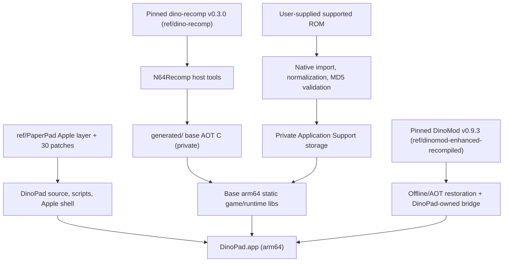
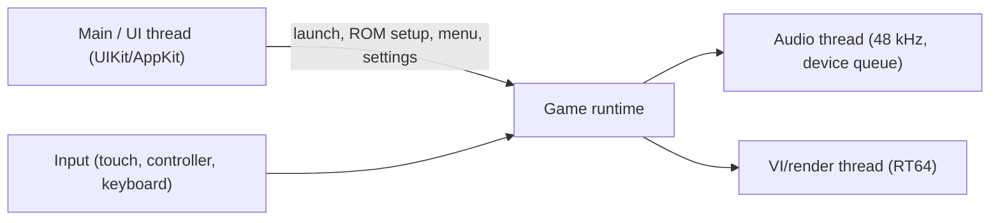
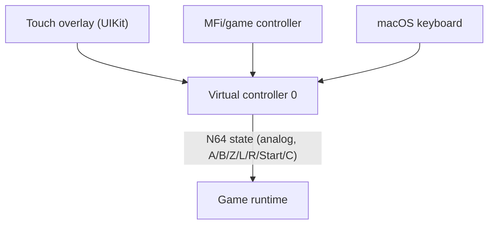

# DinoPad Architecture

Status: living document, Phase 0 bootstrap baseline (2026-08-15).
Source of truth for the architecture; the operating rules live in `IMPLEMENTATION_PLAN.md` and `DINOPAD_GOAL_LOOP.md`.

## 1. Goal and boundaries

DinoPad is a ROM-free, native Apple Silicon port of the December 2000 Dinosaur Planet prototype for macOS, iPhone, and iPad. All game and restoration code shipped in the app is statically compiled for arm64. The runtime never downloads or executes code, never JITs MIPS, and never loads arbitrary `.nrm` files. The user imports their own supported ROM (MD5 `49f7bb346ade39d1915c22e090ffd748`), which is validated and stored privately in the app container.

Two gameplay modes share one binary:

- Restored Adventure (recommended default): base game plus a pinned, build-time-integrated DinoMod Enhanced `v0.9.3` restoration.
- Prototype Mode: base game without restoration hooks or assets.

## 2. Data and build pipeline



No ROM, save, generated AOT source, or private fixture is tracked or packaged. `generated/` holds ROM-derived AOT output and is ignored; `ref/` holds exact read-only upstream checkouts.

## 3. Runtime layers

The runtime is split into five DinoPad-owned layers (names from `IMPLEMENTATION_PLAN.md` section 4.1):

| Layer | Responsibility | Primary port source |
|---|---|---|
| `DinoPadPlatform` | UIKit/AppKit lifecycle, Metal surface, safe areas, orientation, Files import, app-container paths, audio session, share sheet, diagnostics | `ref/paperpad/apple/app/*`, `src/paperpad_paths.mm` |
| `DinoPadInput` | Full N64 input state, multi-touch, floating/fixed analog, D-pad, A/B/Z/L/R/Start/C, controller mapping, handoff, input clearing, macOS keyboard | `ref/paperpad/src/paperpad_main.cpp`, touch overlay in `ios_main.mm` |
| `DinoPadRuntime` | Base recompiled game, N64ModernRuntime, RT64 Metal, ROM reads, audio, saves, config bridge, frame timing, clean shutdown | `ref/dino-recomp/src/*` adapted for Apple |
| `DinoPadRestoration` | Pinned DinoMod code, AOT-converted mod functions, hook/replacement/event registration, config schema, enable/disable at session start | `ref/dinomod-enhanced-recompiled` (read-only) + DinoPad-owned bridge |
| `DinoPadUI` | First-run ROM setup, home/mode chooser, persistent `•••` menu, settings, touch layout editor, warnings | `ref/paperpad/apple/app/ios_main.mm`, `rom_setup.mm` |

## 4. Upstream baseline (observed in pinned source)

### 4.1 dino-recomp v0.3.0 = `725b2ede9cacc57968e0a028efed8df9235ba483`

Desktop-only upstream (Windows/Linux; macOS support issue open). Verified Apple-relevant observations:

- `src/renderer/renderer.cpp` already maps `RT64::UserConfiguration::GraphicsAPI::Metal` and constructs the RT64 app core with a `window`/`view` pair on `__APPLE__` (CAMetalLayer-style handoff). The Metal RHI path exists in the RT64 fork (`lib/rt64`, dino-planet branch).
- `src/runtime/support.cpp` has `__APPLE__` blocks: bundle resource directory for program path, UI-thread dispatch for file dialogs, SDL message box.
- `src/runtime/gfx.cpp` `create_window()` is the blocking gap: it is SDL-based, forces `SDL_WINDOW_VULKAN` under `RT64_SDL_WINDOW_VULKAN`, and ends with `static_assert(false && "Unimplemented")` on Apple. A DinoPad adapter must provide the Apple window handle (`WindowHandle` with `window` + `view`), matching what `renderer.cpp` expects on `__APPLE__`.
- CMake is Windows/Linux-only for app targets, but already has APPLE branches for shader tooling (dxc-macos, spirv-cross arm64 libs) and RT64 static builds.
- Launcher is RmlUi-based; a `--skip-launcher` CLI flag already bypasses it (shortest first-frame path).
- ROM loading lives in `src/runtime/preload.cpp` (Windows mapping path present; other platforms partial). Game code is marked `has_compressed_code = true` with a ROM patch routine (`patch_rom`) applied at entry; `SaveType::Flashram`.
- Audio uses SDL audio devices at 48 kHz; RSP audio microcode configs live under `rsp/`; game patches are MIPS assembly compiled to an ELF (`patches/`) and recompiled to C through `patches.toml` (RecompPatcher).
- AOT generation is ROM-derived and must stay private (`generated/`), following the plan's no-ROM-derived-source-in-Git rule.

### 4.4 Critical build invariant: weak-symbol link order

The N64Recomp output declares every generated function with `RECOMP_FUNC` =
`extern inline __attribute__((weak,noinline))` on Clang. The base game code and
the recompiled patch library therefore both define the same symbols
(e.g. `dll_load`, `dll_load_deferred`, `init_dll_system`), and the linker keeps
the FIRST definition. The patch library MUST be linked before the base library
(upstream: `PatchesLib RecompiledFuncs`). With the base first, the patch
replacements are dead code and the game's DLL loading never registers overlays
with the runtime, causing `Failed to find function at 0x...` boot crashes.
This was the macOS boot blocker fixed on 2026-08-15.

### 4.2 DinoMod Enhanced v0.9.3 = `d79e86be2304cba75216b0b98e9fb53ee99b7500`

- Contains MIPS mod sources, `dino.datasyms_extra.toml`, `mod.ld`, assets, and `tools/`; two submodules (`dino-recomp-decomp-bridge`, `dino-recomp-mod-api`).
- No conventional LICENSE file present (research pass conclusion stands: redistribution blocked until maintainer clearance).
- Package is an `.nrm` (MIPS code + symbols + assets). Desktop loads it live; DinoPad must convert it AOT at build time via `OfflineModRecomp`/equivalent and statically link the result (experiments in `IMPLEMENTATION_PLAN.md` section 7.3).

### 4.3 PaperPad = `644945d4bc4facbbd8ecda8cdfd37ae64e7993fa`

The Apple shell reference. Relevant structure:

- `apple/app/` (13 files): `ios_main.mm` (1327 lines - UIKit lifecycle, Metal-capable SDL window handoff, settings, accessible `•••` menu, touch overlay, safe areas, layout editing, lifecycle callbacks), `rom_setup.mm` (402 - picker, byte-order normalization, fingerprint validation, protected private storage, ROM replacement), `diagnostics.mm` (347 - bounded private stderr tee, diagnostic report, path replacement, system share sheet), `touch_tap_latch.h`, `Info.plist.in`, `PrivacyInfo.xcprivacy`, `ThirdPartyNotices.txt`, asset catalog.
- `src/`: `paperpad_main.cpp` (runtime startup, SDL event pump, keyboard/controller mappings, touch snapshot merge, graphics settings, shutdown), `paper_rt64_context.cpp` (RT64 Metal config, framebuffer/present cadence), `paperpad_paths.mm` (app-container paths, RT64 data dir override to avoid read-only container root), `paperpad_game_hooks.cpp`, `paper_stubs.cpp`, `register_overlays.cpp`.
- `patches/` (30 patches): the reusable Apple port set. Categories:
  - rt64 iOS/Metal: `ios-metal-main-thread`, `ios-metal-shaders`, `ios-metal-device`, `ios-uikit-window`, `ios-native-file-dialog-null`, `ios-render-target-limit`, `ios-metal-resource-limits`, `ios-metal-view-lifetime`, `ios-expand-visible-area`, `use-provided-sdl2`, `external-host-tools`, `external-zstd-source`, plus Metal correctness fixes (worker lifetime, drawable slot lifetime, clear state cache, descriptor state cache, present wait workload).
  - n64modernruntime Apple: `no-dynamic-code`, `apple-clean-process-exit`, `synchronous-audio-tasks`, `prefer-recompiled-audio-rsp`, `official-ai-queue-feedback`, `paper-mario-audio-headroom`.
  - mstan-rt64 / mstan-n64modernruntime / n64recomp: smaller fixes (HLE audio RSP, VI cadence, flash page wrap, fmt consteval guard, Metal worker autorelease fixes).
- Build scripts: `clone-sources.sh`, `apply-patches.sh`, `prepare-rom.sh`, `build-decomp.sh`, `build-host-tools.sh`, `generate-game.sh`, `build-sdl2.sh`, `build-macos-app.sh`, `build-ios-simulator.sh`, `package-unsigned-ipa.sh`, `audit-ios-package.sh`, `check-repo-safety.sh`.

DinoPad will port the game-independent behavior of these files and patches, adapting identifiers and callbacks; it will not copy Paper Mario game code or assets.

## 5. Thread model

Based on the N64ModernRuntime/ultramodern pattern used by both upstream and PaperPad (to be confirmed against the exact pinned source during bring-up):



- The game thread runs the statically recompiled game loop and N64-shaped memory/scheduler services.
- Audio is produced on the audio thread and pushed to the device queue; PaperPad's `synchronous-audio-tasks` patch and audio headroom behavior are the reference for avoiding underruns.
- Rendering runs in RT64's Metal pipeline; PaperPad's patches (`ios-metal-main-thread`, worker/drawable lifetime fixes) are the reference for iOS Metal ownership.
- DinoPad's RT64/Plume lifetime patches stop and join presentation/workload
  workers before Metal resources are destroyed, scope Apple worker
  autoreleases, and balance encoder ownership. The macOS native-close
  regression exercises this ordering five times per focused smoke.
- UI events (menu, picker, share sheet) must pause safely and clear held input before presentation, per the plan.

## 6. Renderer ownership

- RT64 (dino-planet fork) with the Metal RHI, statically linked; `HLSL_CPU` shader compilation via the vendored dxc-macos tool already referenced in dino-recomp's CMake.
- macOS: SDL-created window or native NSWindow handing a `CAMetalLayer` view to RT64 (`WindowHandle{ window, view }` per the `__APPLE__` branch in `renderer.cpp`).
- iOS: UIKit view with a Metal layer; PaperPad's `ios-uikit-window`, `ios-metal-main-thread`, `ios-metal-view-lifetime`, and `ios-expand-visible-area` patches are the concrete path.
- One drawable/one presentation cadence owned by DinoPad (see PaperPad `paper_rt64_context.cpp`).

## 7. Input flow



- Every source normalizes into controller 0 (PaperPad pattern).
- A connected controller hides gameplay touch controls but never the `•••` button; controller disconnect hands input back to touch without ghost input.
- Opening the menu, picker, or share sheet clears held virtual input and hides gameplay touch targets; targets restore only after the sheet closes and touch controls remain enabled.
- Deterministic input replay is the smoke-test target; a bounded human-assisted checklist is the fallback.

## 8. Save and configuration paths

- Private app-container storage: `Application Support/DinoPad/` (macOS) and the app sandbox equivalent on iOS.
- ROM: private normalized copy after import, never exposed.
- Saves: Flashram-backed (upstream `SaveType::Flashram`), stored under mode-specific roots so Restored and Prototype saves never mix:
  - `Application Support/DinoPad/Profiles/Restored/saves/`
  - `Application Support/DinoPad/Profiles/Prototype/saves/`
- Configuration is isolated under the same profile roots; the validated ROM
  and build-integrated restoration package data remain in the shared DinoPad
  data root.
- RT64 data dir must be explicitly pointed at the container (PaperPad's `paperpad_paths.mm` rationale; the container root is read-only on iPadOS).

## 9. Mode / restoration boundary

- On macOS, a DinoPad-owned AppKit boundary runs before SDL/runtime startup.
  It presents first-run ROM setup, a Restored-primary home, an explicit
  Prototype action with an archival warning, and private ROM replacement.
  Selecting either mode enters the same profile API used by automation; the
  upstream Rml launcher is bypassed.
- The native importer accepts z64/v64/n64 byte order, normalizes to big-endian,
  verifies the exact 64 MiB prototype MD5, writes atomically, excludes the
  private copy from backups, and never stages rejected input.
- Both profiles are compiled into one binary. At session start DinoPad registers the restoration module (hooks, replacements, events, config, assets) only for Restored Adventure; Prototype Mode starts with registration disabled.
- The engine boundary defaults to Restored, accepts explicit
  `--profile restored|prototype`, and rejects unknown values before runtime
  initialization. The native Apple home screen will call this same boundary.
- The current macOS bridge generates a typed table for every OfflineModRecomp
  function and registers a build-time `ModCodeHandle` by manifest ID. Generated
  executable code is statically linked; the private `.nrm` currently supplies
  only manifest, symbol, binary-data, and asset content. A build-time generator
  renames each affected base definition and emits 328 strong wrappers for 294
  replacements and 35 unique hook slots. The wrappers dispatch to the linked
  restoration code only while Restored is active and otherwise call the renamed
  base definitions. N64ModernRuntime records conflicts but performs no code
  writes for this handle.
- Saves and configs are selected by the active profile; switching modes can never read or write the other profile's root.
- Prototype Mode copy must stay honest: platform/renderer/compatibility patches remain, restoration does not.
- DinoMod's own data (`ref/dinomod-enhanced-recompiled`) stays read-only; every bridge/adapter is DinoPad-owned; no AI-generated patches are submitted upstream.

## 10. Mobile no-JIT boundary

The iOS binary must contain only signed static code:

- no JIT, TCC, or LiveRecomp (excluded at CMake level, mirroring PaperPad);
- no runtime-generated machine code;
- no downloadable code, runtime code from `.nrm`, or mod manager;
- no executable-memory entitlement;
- restoration integrated at build time only;
- package audit proves the boundary before any release (`scripts/check-package-safety.sh`, Phase 10).

## 11. Repository layout

```text
apple/            Apple shell (ported from PaperPad, DinoPad-owned)
src/              DinoPad runtime/input/restoration integration
include/          shared headers
cmake/            DinoPad CMake modules
patches/          replayable Apple patches (dino-recomp, rt64, n64modernruntime, n64recomp, sdl)
scripts/          bootstrap, build, guard, smoke, packaging, safety
tools/            mod settings generator, UI compare, ROM normalize, evidence validate
docs/             plan, status, architecture, parity, upstream, integration, evidence
ref/              ignored exact upstream checkouts (PaperPad, dino-recomp, dinomod)
generated/        ignored ROM-derived AOT output
private-fixtures/ ignored private saves (manifest only committed)
```

## 12. Platform bring-up order

macOS arm64 (base frame -> title -> gameplay -> audio/input/save) -> static DinoMod proof on macOS -> PaperPad shell port -> iPhone Simulator -> iPad Simulator -> physical iPhone -> physical iPad -> progression/stability -> packaging/release. Exactly one runtime active at a time (`scripts/runtime-guard.sh`).

## 13. Risks

- `create_window()` static-assert on Apple is the first macOS blocker (adapter needed).
- Remaining RT64 iOS Metal ownership and UIKit patches must be re-derived for
  the dino-planet fork; worker-autorelease and Plume ownership subsets are now
  ported and macOS regression-tested.
- Full DinoMod offline AOT and no-write static dispatch are proven on macOS;
  iOS still needs the private package data embedded and the live-recompiler
  implementation excluded from the mobile link.
- DinoMod redistribution clearance unresolved (release gate only).
- Disk pressure (28 GiB free at bootstrap) before full AOT generation.
